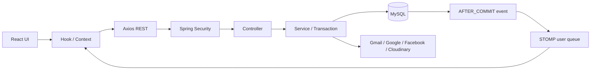
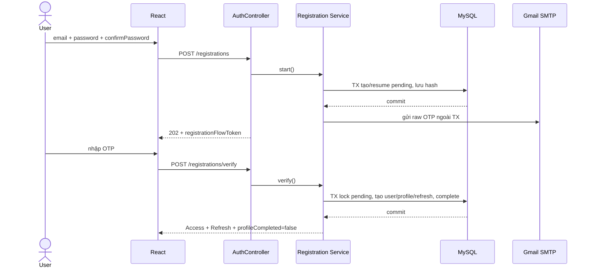

# Hướng dẫn báo cáo Auth và Socket theo code hiện tại

> Cập nhật theo source code trong repository ngày 05/08/2026. `README.md` là nguồn nghiệp vụ ưu tiên cao nhất. Tài liệu này giải thích **implementation thực tế**, đường đi dữ liệu, cách demo và vị trí cần sửa khi thay đổi yêu cầu. Không dùng tài liệu này để thay thế API contract hoặc README.

## 0. Cách dùng tài liệu trong 3 giờ trước khi báo cáo

Nếu thời gian rất gấp, đọc theo thứ tự:

1. Mục 1 để có bài nói 2 phút.
2. Mục 2 để phân biệt các loại token.
3. Mục 4.1, 4.2, 4.4 để nắm đăng ký OTP, đăng nhập và refresh.
4. Mục 5.1 đến 5.6 để nắm Socket, Notification và Messaging.
5. Mục 8 để tập demo.
6. Mục 9 để chuẩn bị câu hỏi của giảng viên.
7. Mục 10 để biết sửa file nào khi giảng viên đổi yêu cầu.

Khi trình bày, luôn tách hai ý:

- **Auth** trả lời câu hỏi “người gọi là ai, được phép làm gì và phiên đăng nhập còn hợp lệ không?”.
- **Socket** chỉ giúp Client nhận thay đổi nhanh hơn; **REST API và MySQL mới là nguồn dữ liệu chuẩn**.

---

## 1. Bài nói tổng quan trong 2 phút

Hệ thống dùng kiến trúc ReactJS → REST API Spring Boot → MySQL. Auth hỗ trợ email/password có OTP, Google và Facebook. Dù đăng nhập bằng phương thức nào, kết quả cuối cùng vẫn là một tài khoản nội bộ `users.id`. Backend không tin thông tin social do Frontend tự khai báo mà tự xác minh credential với Google/Facebook.

Đăng ký email không tạo user ngay. Backend chỉ tạo `pending_registrations`, trong đó mật khẩu đã được BCrypt, OTP và flow token chỉ lưu dạng HMAC hash. Khi OTP hợp lệ, Backend khóa bản ghi pending và trong một transaction tạo `users`, `user_profiles`, Refresh Token, chuyển pending sang `COMPLETED`; sau đó cấp JWT Access Token.

Access Token là JWT ngắn hạn dùng gọi API. Refresh Token dài hạn hơn, DB chỉ lưu hash và token được rotate khi refresh. Logout thu hồi Refresh Token hiện tại. Tài khoản `ACTIVE` nhưng chưa có `profile_completed_at` vẫn chưa được dùng chức năng mạng xã hội.

Realtime dùng một native WebSocket/STOMP connection duy nhất trên mỗi tab tại `/ws`. JWT được gửi ở STOMP `CONNECT`, không nằm trong URL. Frontend subscribe hai user queue: `/user/queue/notifications` và `/user/queue/messaging`. Gửi tin nhắn, đánh dấu đã đọc và mọi dữ liệu bền vững vẫn đi bằng REST; Socket chỉ nhận event sau khi transaction MySQL đã commit. Riêng typing indicator là dữ liệu tạm thời nên được phép gửi STOMP đến `/app/messaging/typing`, không lưu database.

Nếu Socket mất kết nối, dữ liệu không mất vì REST/MySQL là nguồn chuẩn. Frontend reconnect, reconcile lại bằng REST và polling mỗi 30 giây khi tab đang hiển thị.



---

## 2. Phân biệt 6 loại token/credential

| Loại | Do ai cấp | Dùng ở đâu | Lưu phía Backend | Lưu phía Frontend hiện tại | Không được dùng để |
|---|---|---|---|---|---|
| Access Token | Backend | `Authorization: Bearer ...` cho REST và STOMP `CONNECT` | Không lưu phiên; JWT stateless | Memory trong `tokenManager` | Refresh phiên hoặc thay provider token |
| Refresh Token | Backend | Body của refresh/logout | Chỉ SHA-256 hash trong `refresh_tokens` | `localStorage` | Gọi Feed/Post/Socket trực tiếp |
| Registration flow token | Backend | Status/resend/cancel/verify đăng ký | HMAC hash trong `pending_registrations` | `sessionStorage` | Gọi API nghiệp vụ |
| OTP | Backend | Xác minh email/recovery/link email | HMAC hash | Chỉ ở ô nhập, không persist | Thay Access Token |
| Social credential | Google/Facebook | Endpoint OAuth/reauth/link tương ứng | Không dùng như JWT hệ thống | Chỉ giữ đủ cho request provider | Gọi API mạng xã hội |
| Reauth/reset/conflict token | Backend | Một thao tác nhạy cảm, phạm vi hẹp | HMAC hash trong challenge tương ứng | Tạm thời theo flow | Dùng lại hoặc đổi phạm vi |

Điểm cần nói rõ:

- “Hash at rest” nghĩa là database bị đọc trộm cũng không lộ raw OTP/Refresh Token ngay lập tức.
- Access Token đã phát hành vẫn còn hiệu lực tới lúc hết hạn vì hệ thống chưa có `tokenVersion`/denylist Access Token.
- Logout thu hồi Refresh Token và Frontend xóa local session; logout không thể thu hồi ngay JWT stateless đã phát hành.
- Code hiện tại persist Refresh Token ở `localStorage`. Đây là implementation hiện hành và là điểm có thể nâng cấp sang HttpOnly Secure cookie để giảm rủi ro XSS.

---

## 3. Bản đồ code cần nhớ

### 3.1 Frontend Auth

| File | Vai trò |
|---|---|
| `FrontEnd/src/router/index.jsx` | Khai báo URL Login/Register/Onboarding/Settings |
| `FrontEnd/src/router/routeGuards.jsx` | Phân biệt guest, authenticated, profile incomplete và ADMIN |
| `FrontEnd/src/api/apiEndpoints.js` | Tập trung path endpoint |
| `FrontEnd/src/api/authApi.js` | Gửi HTTP Auth, gắn `X-Auth-Flow-Token` khi cần |
| `FrontEnd/src/api/httpClient.js` | Gắn Access Token, bắt lỗi 401, refresh và retry đúng một lần |
| `FrontEnd/src/api/tokenManager.js` | Access Token memory; Refresh Token/session snapshot `localStorage` |
| `FrontEnd/src/contexts/AuthContext.jsx` | State phiên toàn ứng dụng, bootstrap/refresh/login/logout |
| `FrontEnd/src/contexts/RegistrationContext.jsx` | State machine của pending registration/OTP |
| `FrontEnd/src/features/auth/services/*` | Chuyển use case UI thành lời gọi `authApi` |
| `FrontEnd/src/features/auth/hooks/*` | Loading, error, operation lock và điều hướng từng flow |

### 3.2 Backend Auth và Security

| File/package | Vai trò |
|---|---|
| `auth/controller/AuthController.java` | Đăng ký, OTP, login, social, refresh, logout |
| `auth/controller/PasswordRecoveryController.java` | Forgot/verify/resend/complete password recovery |
| `auth/controller/AuthMethodController.java` | List/link/unlink EMAIL/GOOGLE/FACEBOOK |
| `auth/service/RegistrationServiceImpl.java` | Điều phối tạo pending rồi gửi OTP ngoài transaction |
| `auth/service/RegistrationTransactionService.java` | Tạo/resume pending, sinh/hash OTP và flow token |
| `auth/service/RegistrationVerificationTransactionService.java` | Verify OTP và tạo account/session nguyên tử |
| `auth/service/AuthServiceImpl.java` | Login, Refresh Token rotation và logout |
| `auth/service/GoogleAuthTransactionService.java` | Luồng Google và xử lý race/conflict |
| `auth/service/SocialAuthenticationTransactionService.java` | Luồng social chung/Facebook |
| `auth/service/PasswordRecoveryServiceImpl.java` | Real/decoy recovery challenge |
| `security/JwtAuthenticationFilter.java` | Xác thực Bearer Access Token cho REST |
| `security/ProfileCompletionFilter.java` | Chặn API chính khi onboarding chưa xong |
| `security/SecurityConfig.java` | Stateless, CORS, public Auth paths, ADMIN và `/ws` handshake |

### 3.3 Socket/Realtime

| File | Vai trò |
|---|---|
| `FrontEnd/src/config/realtimeSocketCore.js` | Manager một STOMP client, reconnect, subscribe, allowlist SEND |
| `FrontEnd/src/config/realtimeSocket.js` | Singleton và chuyển HTTP URL thành WS/WSS URL |
| `FrontEnd/src/contexts/RealtimeContext.jsx` | Owner duy nhất của lifecycle Socket theo Auth state |
| `FrontEnd/src/contexts/NotificationContext.jsx` | Subscribe Notification, dedupe, reconcile, polling |
| `FrontEnd/src/contexts/MessagingContext.jsx` | Inbox/history/event/optimistic send/read/typing |
| `notification/config/NotificationWebSocketConfig.java` | Endpoint `/ws`, broker `/queue`, prefix `/app`, `/user` |
| `notification/security/StompJwtChannelInterceptor.java` | Verify JWT ở CONNECT, allowlist SUBSCRIBE và SEND |
| `notification/event/NotificationRealtimeListener.java` | Phát `NOTIFICATION_CREATED` sau commit |
| `messaging/event/MessagingRealtimeListener.java` | Phát `MESSAGE_CREATED`, `MESSAGES_READ` sau commit |
| `messaging/controller/MessagingTypingController.java` | Điểm nhận STOMP SEND duy nhất |
| `messaging/service/impl/MessagingTypingServiceImpl.java` | Kiểm tra membership/Block/rate limit và phát typing |

---

## 4. Luồng Auth chi tiết

### 4.1 Đăng ký email → OTP → tạo tài khoản

#### Bước 1: bắt đầu đăng ký

```text
RegisterPage
→ useRegistration
→ RegistrationContext.startRegistration
→ registrationService.startRegistration
→ authApi.startRegistration
→ POST /api/v1/auth/registrations
→ AuthController.startRegistration
→ RegistrationServiceImpl.start
→ RegistrationTransactionService.create
→ pending_registrations
→ gửi OTP Gmail ngoài transaction
```

Backend thực hiện:

1. Chuẩn hóa email: trim và lowercase.
2. Kiểm tra password/confirmPassword và chính sách mật khẩu.
3. Kiểm tra email chưa thuộc account thật.
4. Khóa/tìm pending còn hiệu lực theo `active_identifier_key = EMAIL:<email>`.
5. Nếu pending hợp lệ đã tồn tại thì resume, không tạo bản ghi trùng.
6. Nếu chưa có, BCrypt password; sinh OTP và flow token bằng nguồn ngẫu nhiên an toàn.
7. Lưu `password_hash`, `otp_hash`, `flow_token_hash`, expiry/cooldown; không lưu raw secret.
8. Commit transaction ngắn.
9. Gửi OTP qua Gmail SMTP sau đó cập nhật delivery status bằng transaction riêng.
10. Trả HTTP `202` cùng raw flow token cho đúng Client vừa bắt đầu flow.

Tại thời điểm này **chưa có** `users`, `user_profiles`, Access Token hoặc Refresh Token.

#### Bước 2: xác minh OTP

```text
VerifyRegistrationOtpPage
→ RegistrationContext.verifyOtp
→ POST /api/v1/auth/registrations/verify
→ RegistrationVerificationTransactionService.verify
→ SELECT pending FOR UPDATE
→ kiểm tra HMAC/expiry/attempt
→ INSERT users
→ INSERT user_profiles
→ INSERT refresh_tokens(hash)
→ UPDATE pending = COMPLETED
→ COMMIT
→ trả Access Token + Refresh Token
→ chuyển /onboarding/profile
```

Toàn bộ thay đổi quan trọng nằm trong cùng transaction. Nếu tạo profile hoặc token thất bại, user cũng rollback. `SELECT ... FOR UPDATE` ngăn hai request đồng thời cùng consume một OTP.



#### Status, resend, cancel

- Status: `GET /api/v1/auth/registrations/status`, flow token ở `X-Auth-Flow-Token`.
- Resend: `POST /api/v1/auth/registrations/resend`, flow token trong body theo code hiện tại.
- Cancel: `POST /api/v1/auth/registrations/cancel`, flow token trong body.
- OTP mới thay OTP cũ; cooldown mặc định 60 giây.
- OTP mặc định 10 phút, tối đa 5 lần sai; pending mặc định 24 giờ.
- Flow được Frontend lưu ở `sessionStorage`, vì vậy reload cùng tab có thể tiếp tục.

### 4.2 Đăng nhập local

```text
LoginPage
→ useLogin
→ AuthContext.login
→ authService.loginLocal
→ POST /api/v1/auth/login
→ AuthController.login
→ AuthServiceImpl.login
→ User/Profile repositories
→ BCrypt matches
→ INSERT refresh_tokens(hash)
→ JwtService.generateAccessToken
→ Frontend persist session
```

Backend từ chối nếu:

- Email/mật khẩu sai.
- Email chưa verified.
- Tài khoản social-only có `password_hash = NULL`.
- `users.status = BLOCKED`.
- Dữ liệu profile/account không hợp lệ.

Sau thành công, hướng đi phụ thuộc state:

- Chưa hoàn tất hồ sơ → `/onboarding/profile`.
- USER đã hoàn tất → Feed/home.
- ADMIN → khu vực Admin theo `getAuthenticatedHome`.

### 4.3 Google/Facebook

```text
Provider SDK ở Browser
→ trả ID token/access token
→ Frontend gửi credential tới endpoint Auth
→ Backend Official verifier gọi/xác minh với provider
→ nhận immutable provider user ID
→ Transaction tìm user_auth_providers
→ login account cũ / tạo account mới / tạo social conflict
→ Backend cấp JWT hệ thống
```

Quy tắc quan trọng:

- Google dùng `sub`; Facebook dùng provider user ID.
- Backend không tin `providerUserId`, email hoặc verified do Frontend gửi.
- Unique `(provider, provider_user_id)` bảo đảm một danh tính provider không thuộc hai user.
- Trùng email với account `ACTIVE` chưa đủ để tự merge.
- Pending email và social cùng email verified có thể hoàn tất một account và giữ cả local + social.
- Pending khác social email phải đi qua challenge để người dùng chọn tiếp tục OTP hoặc hủy pending.

### 4.4 Access Token hết hạn → Refresh Token rotation

```text
Protected REST trả 401 + ACCESS_TOKEN_EXPIRED
→ httpClient kiểm tra request chưa retry
→ mọi request đồng thời chờ cùng refreshPromise
→ POST /api/v1/auth/refresh-token {refreshToken}
→ Backend hash raw token và SELECT FOR UPDATE
→ kiểm tra expiry/revoked/user status
→ revoke token cũ + insert hash token mới
→ cấp Access Token mới
→ Frontend cập nhật tokenManager
→ retry request cũ đúng một lần
```

Hai lớp chống “refresh storm”:

- `httpClient.js` gom nhiều response 401 vào một Promise.
- `authService.js` cũng giữ một `refreshPromise` cho bootstrap/interceptor.

Khi reload trang, Access Token memory mất. `AuthContext` đọc session snapshot + Refresh Token persisted và gọi refresh để dựng lại Access Token.

### 4.5 Logout

Frontend gửi Refresh Token tới `/auth/logout`. Backend hash, lock và set `revoked_at`; gọi lại logout vẫn thành công (idempotent). Trong `finally`, Frontend luôn xóa Access Token, Refresh Token và session snapshot kể cả request Backend thất bại.

### 4.6 Onboarding và quyền truy cập

`users.status = ACTIVE` chỉ có nghĩa account không bị Admin khóa. Quyền dùng mạng xã hội phụ thuộc thêm `user_profiles.profile_completed_at`.

```text
JWT hợp lệ
→ JwtAuthenticationFilter tạo principal
→ ProfileCompletionFilter kiểm tra profile
→ Auth/onboarding endpoint được phép
→ API mạng xã hội trả PROFILE_NOT_COMPLETED nếu chưa hoàn tất
```

Tên hiển thị và ngày sinh bắt buộc; Backend kiểm tra đủ 18 tuổi. Frontend route guard giúp trải nghiệm, nhưng Backend mới là lớp quyết định cuối cùng.

### 4.7 Forgot password

Luồng gồm start → verify OTP → complete. Start luôn trả response trung tính. Email không tồn tại, chưa verified, social-only hoặc BLOCKED dùng **decoy challenge** có vòng đời giống challenge thật nhưng không gửi mail. Nhờ đó người ngoài khó dò email nào có account.

Khi complete:

- Cập nhật BCrypt password.
- Consume reset token một lần.
- Thu hồi toàn bộ Refresh Token của user trong cùng transaction.
- Không tự đăng nhập và không cấp JWT mới.

### 4.8 Link/unlink phương thức đăng nhập

- Link EMAIL: OTP challenge rồi mới gắn email/password method.
- Link GOOGLE/FACEBOOK: Backend verify credential trong phiên JWT hiện tại.
- User đích luôn lấy từ JWT, không nhận `userId` từ Client.
- Unlink yêu cầu reauthentication token ngắn hạn, đúng scope và one-time.
- Không gỡ phương thức cuối cùng.

---

## 5. Socket/WebSocket/STOMP chi tiết

### 5.1 WebSocket và STOMP khác nhau thế nào?

- WebSocket là kết nối hai chiều giữ lâu giữa Browser và Server.
- STOMP là giao thức message chạy trên WebSocket, cung cấp `CONNECT`, `SUBSCRIBE`, `SEND` và destination.
- Dự án dùng native WebSocket, không dùng SockJS.
- Backend dùng Spring simple broker; chưa có RabbitMQ/Kafka/Outbox.

### 5.2 Tạo kết nối và xác thực

Khi Auth state thỏa `authenticated + profileCompleted + không BLOCKED`, `RealtimeProvider` activate singleton `realtimeSocket`.

```text
VITE API base: http://localhost:8080
→ toWebSocketUrl
→ ws://localhost:8080/ws
→ STOMP CONNECT header Authorization: Bearer <accessToken>
→ StompJwtChannelInterceptor
→ JwtService.extractUserIdFromAccessToken
→ kiểm tra user tồn tại, ACTIVE, profile completed
→ principal.name = users.id
```

HTTP handshake `/ws` được `permitAll` vì Browser chưa đặt Bearer header ở bước upgrade. Đây không phải bỏ xác thực: JWT được kiểm tra ngay tại frame STOMP `CONNECT` trước khi subscribe/send.

Backend allowlist:

| STOMP action | Destination được phép |
|---|---|
| SUBSCRIBE | `/user/queue/notifications` |
| SUBSCRIBE | `/user/queue/messaging` |
| SEND | `/app/messaging/typing` |

Mọi destination khác bị từ chối. Client không thể subscribe queue của user khác vì Spring resolve `/user/...` theo authenticated principal.

### 5.3 Một connection dùng chung

Thứ tự provider trong `App.jsx`:

```text
AuthProvider
└── RealtimeProvider        ← owner duy nhất của socket
    ├── NotificationProvider
    └── MessagingProvider
```

`realtimeSocket.js` export module singleton. `realtimeSocketCore.js` multiplex callback theo destination, nên Notification và Messaging dùng chung một STOMP client/connection trên mỗi tab.

Cấu hình chính:

- Reconnect delay ban đầu 1 giây, exponential, tối đa 30 giây.
- Connection timeout 10 giây.
- Heartbeat vào/ra 10 giây.
- Không log frame vì CONNECT chứa Access Token.
- Trước mỗi connect/reconnect, lấy Access Token mới từ memory.

### 5.4 Luồng Notification realtime

Ví dụ B like bài của A:

```text
B gọi REST Like
→ PostLikeService transaction
→ NotificationServiceImpl.createPostLikeNotification
→ kiểm tra self notification, Block, Restrict suppression
→ INSERT notifications
→ publish NotificationCreatedEvent(id, recipientId)
→ COMMIT
→ NotificationRealtimeListener AFTER_COMMIT
→ đọc lại projection còn visible + tính unread authoritative
→ convertAndSendToUser(A.id, /queue/notifications, envelope)
→ A nhận ở /user/queue/notifications
→ NotificationContext dedupe eventId/notificationId và cập nhật badge
```

Nếu broker lỗi, Notification đã commit vẫn tồn tại. Listener chỉ log warning; REST/MySQL không rollback.

Envelope khái niệm:

```json
{
  "schemaVersion": 1,
  "eventId": "uuid",
  "eventType": "NOTIFICATION_CREATED",
  "occurredAt": "UTC datetime",
  "notificationId": 123,
  "notification": {},
  "unreadCount": 4
}
```

Read/read-all/delete Notification hiện đi qua REST, chưa phát realtime invalidation.

### 5.5 Gửi và nhận tin nhắn

Điểm dễ nhầm nhất: **Client gửi message bằng REST, không SEND message qua Socket**.

#### Text message

```text
MessageThread
→ MessagingContext.sendMessage
→ tạo UUID v4 clientMessageId + optimistic item
→ POST /api/v1/conversations/{id}/messages
→ MessagingController
→ MessagingServiceImpl.sendMessage
→ lấy sender từ SecurityContext
→ kiểm tra USER/ACTIVE/onboarding/membership/Block/Follow nếu là tin đầu
→ pair lock + conversation lock
→ kiểm tra idempotency (sender_id, client_message_id)
→ INSERT messages + update conversations.last_message_id
→ publish MessageCreatedEvent
→ COMMIT
→ MessagingRealtimeListener AFTER_COMMIT
→ phát MESSAGE_CREATED cho cả hai participant
→ MessagingContext merge theo messageId/clientMessageId
```

`clientMessageId` giúp retry request không tạo hai message. Cùng key + cùng payload trả bản ghi cũ (`replayed=true`); cùng key + payload khác trả `IDEMPOTENCY_KEY_REUSED`.

#### Image message

Frontend gửi cùng path nhưng `multipart/form-data`: `clientMessageId`, `content` tùy chọn và tối đa 5 `images`. Backend validate extension, MIME, magic bytes/decode, size/dimensions và SHA-256 fingerprint.

Cloudinary upload ở ngoài transaction MySQL dài. DB chỉ lưu `storage_public_id` và metadata, không phát public URL trong history/event. Muốn xem ảnh, Client gọi `GET /api/v1/message-attachments/{id}/access`; Backend kiểm tra lại account, onboarding, membership và Block rồi cấp signed URL mặc định 5 phút. Nếu DB lưu thất bại sau upload, Backend xóa bù; xóa lỗi được ghi `media_cleanup_tasks` để scheduler retry.

#### Điều kiện mở conversation

- Chỉ USER, ACTIVE, hoàn tất hồ sơ.
- Không nhắn chính mình.
- Một cặp user chỉ có một conversation nhờ cặp `participant_low_id/high_id` duy nhất.
- A bắt đầu conversation với B chỉ khi B đang follow A.
- Conversation rỗng không hiện trong Inbox.
- Trước tin đầu tiên Backend kiểm tra Follow lại; sau tin đầu, Unfollow không đóng conversation.
- Block hai chiều ẩn/chặn list, history, send, read và unread; Restrict không ảnh hưởng Messaging.

### 5.6 Mark read

```text
Frontend PUT /conversations/{id}/read {lastReadMessageId}
→ lock membership
→ kiểm tra message thuộc đúng conversation
→ chỉ advance marker, không lùi
→ publish MessagesReadEvent nếu marker thật sự tiến
→ COMMIT
→ phát MESSAGES_READ cho hai participant
```

Unread được query từ message của participant còn lại; không dùng counter denormalized. Envelope gửi cho từng user có `unreadCount` authoritative riêng.

### 5.7 Typing indicator

Typing là ngoại lệ duy nhất được Client STOMP `SEND`:

```text
Frontend SEND /app/messaging/typing
body {conversationId, typing}
→ inbound interceptor allowlist
→ MessagingTypingController @MessageMapping("/messaging/typing")
→ principal.name lấy từ JWT, không nhận senderId từ payload
→ MessagingTypingServiceImpl
→ rate limit 4 frame/user/giây trong từng instance
→ query membership + account + Block
→ convertAndSendToUser(otherUserId, /queue/messaging)
→ TYPING_STARTED hoặc TYPING_STOPPED
```

Typing không ghi database, không tạo Notification, không tăng unread, không replay và không cần `AFTER_COMMIT` vì không có state bền vững.

Frontend:

- Gửi START khi bắt đầu nhập.
- Refresh START khoảng mỗi 3 giây nếu vẫn nhập.
- Gửi STOP sau 2 giây idle/submit/blur/leave.
- Receiver tự xóa trạng thái START sau 5 giây để tránh kẹt “đang nhập...” khi mất gói.

### 5.8 Mất kết nối và phục hồi

Khi reconnect thành công:

- Notification tải lại unread count và page đầu nếu đã khởi tạo.
- Messaging tải unread count, Inbox và history conversation đang mở.
- Event được dedupe bằng `eventId`; Notification còn dedupe bằng `notificationId`; message merge bằng `messageId/clientMessageId`.

Khi disconnected:

- Nếu tab visible, hai Context polling/reconcile REST mỗi 30 giây.
- Khi tab chuyển lại visible, reconcile ngay.
- Typing state bị xóa vì đây là dữ liệu tạm.

Đây là lý do có thể nói Socket là **best-effort acceleration**, không phải nguồn sự thật.

---

## 6. Dữ liệu nằm ở bảng nào?

### 6.1 Auth

| Bảng | Dữ liệu chính | Hàng rào quan trọng |
|---|---|---|
| `users` | Email, password hash, role, status | Unique email; password chỉ tồn tại cùng verified email |
| `user_profiles` | Display name, DOB, avatar, bio, completion | PK/FK cùng `users.id`; completion cần display name + DOB |
| `pending_registrations` | Pending lifecycle và các hash | Unique active identifier, unique flow hash, attempts/expiry checks |
| `user_auth_providers` | Liên kết Google/Facebook | Unique provider identity và unique provider per user |
| `refresh_tokens` | Hash phiên dài hạn | Unique token hash, expiry/revoked fields |
| `social_auth_challenges` | Conflict social | One active provider challenge, token hash, lifecycle |
| `auth_method_link_challenges` | OTP link email | Unique active identifier/user-purpose |
| `reauthentication_challenges` | Proof trước unlink | Token hash, scope, one active user-scope |
| `password_recovery_challenges` | Real/decoy recovery | Flow/OTP/reset hash và state machine |

### 6.2 Realtime và Messaging

| Bảng | Dữ liệu chính | Hàng rào quan trọng |
|---|---|---|
| `notifications` | Notification bền vững/read/delete | Index recipient + unread; Block/Restrict do service enforce |
| `conversations` | Một conversation/cặp user, last message | Unique low/high pair |
| `conversation_members` | Hai member và read marker | PK `(conversation_id,user_id)` |
| `messages` | Text/image metadata, client key | Unique `(sender_id,client_message_id)` |
| `message_attachments` | Private storage ID và metadata | Unique message order/storage asset |
| `media_cleanup_tasks` | Retry xóa asset orphan | Index theo status/next retry |

Socket connection và typing indicator không có bảng riêng.

SQL và DBML hiện có đủ các bảng/ràng buộc trên. `conversations.last_message_id` và `conversation_members.last_read_message_id` có FK, còn điều kiện “message phải thuộc đúng conversation” vẫn được Service kiểm tra vì FK đơn không diễn tả đầy đủ invariant này.

---

## 7. API và destination dùng khi demo

### Auth public

| Method | Path | Mục đích |
|---|---|---|
| POST | `/api/v1/auth/registrations` | Tạo/resume pending |
| POST | `/api/v1/auth/registrations/verify` | Verify OTP và tạo account |
| POST | `/api/v1/auth/registrations/resend` | OTP mới |
| GET | `/api/v1/auth/registrations/status` | Khôi phục pending |
| POST | `/api/v1/auth/registrations/cancel` | Hủy pending |
| POST | `/api/v1/auth/login` | Login local |
| POST | `/api/v1/auth/oauth/google` | Google Auth |
| POST | `/api/v1/auth/oauth/facebook` | Facebook Auth |
| POST | `/api/v1/auth/refresh-token` | Rotate token |
| POST | `/api/v1/auth/logout` | Revoke phiên hiện tại |
| POST | `/api/v1/auth/password-recovery...` | Start/verify/resend/complete recovery |

### Messaging REST

| Method | Path | Mục đích |
|---|---|---|
| GET | `/api/v1/conversations` | Inbox cursor |
| GET | `/api/v1/conversations/unread-count` | Tổng unread |
| PUT | `/api/v1/conversations/direct/{recipientUserId}` | Mở/tạo direct conversation |
| GET | `/api/v1/conversations/{id}/messages` | History cursor |
| POST | `/api/v1/conversations/{id}/messages` | Gửi text JSON hoặc ảnh multipart |
| PUT | `/api/v1/conversations/{id}/read` | Advance read marker |
| GET | `/api/v1/message-attachments/{id}/access` | Signed URL ảnh |

### STOMP

| Loại | Destination |
|---|---|
| Endpoint | `/ws` |
| Subscribe Notification | `/user/queue/notifications` |
| Subscribe Messaging | `/user/queue/messaging` |
| Send typing | `/app/messaging/typing` |

---

## 8. Kịch bản demo 10–15 phút

### Chuẩn bị

1. Chạy MySQL schema đúng với `database/student_social_network.sql`.
2. Cấu hình các secret Auth/Gmail/Cloudinary cần thiết; không chiếu secret lên màn hình.
3. Chạy Backend ở `8080`, Frontend ở `5173`.
4. Mở hai cửa sổ Browser hoặc một cửa sổ thường + Incognito cho User A và B.
5. Mở DevTools Network, bật filter `Fetch/XHR` và `WS`.

### Demo Auth

1. Đăng ký email mới.
2. Trong DB cho thấy chỉ có `pending_registrations`, chưa có `users` tương ứng.
3. Nhập OTP.
4. Cho thấy sau verify mới có `users`, `user_profiles`, `refresh_tokens`; cột secret là hash.
5. Cho thấy Frontend chuyển onboarding.
6. Thử vào Feed trước completion để giải thích Frontend guard và Backend `PROFILE_NOT_COMPLETED`.
7. Hoàn tất profile rồi vào Feed.
8. Trong Network chỉ ra Bearer Access Token ở protected REST request.
9. Nếu có thời gian, refresh trang để giải thích Access Token memory được dựng lại từ refresh flow.

### Demo Socket/Notification

1. Hai user đăng nhập và hoàn tất profile.
2. Trong Network → WS, chỉ ra một connection `/ws`.
3. Chỉ ra STOMP `CONNECT` có Authorization và hai `SUBSCRIBE` user queue.
4. User B like/follow/comment nội dung của A.
5. A nhận badge Notification ngay mà không reload.
6. Nhấn đọc/xóa để nói rõ mutation này vẫn là REST.

### Demo Messaging

1. Đảm bảo điều kiện Follow đúng hướng để mở conversation.
2. User A gửi text; Network chỉ ra request REST `POST /messages`.
3. User B nhận `MESSAGE_CREATED` qua WS.
4. User B mở conversation; chỉ ra REST mark-read và event `MESSAGES_READ`.
5. Nhập chữ để thấy `TYPING_STARTED/STOPPED`; nhấn mạnh typing không lưu DB.
6. Gửi ảnh; chỉ ra multipart REST, metadata trong event và request riêng lấy signed URL.
7. Tắt Network/Backend Socket ngắn rồi bật lại; cho thấy reconnect và REST reconciliation.

### Nếu demo lỗi

- Không cố chứng minh Socket là nguồn dữ liệu. Reload/reconcile bằng REST và giải thích đúng thiết kế best-effort.
- Nếu Gmail/provider thật chưa cấu hình, trình bày bằng test + code trace; không hard-code hoặc lộ secret.
- Nếu social login lỗi, phân biệt lỗi SDK/credential/provider config với lỗi transaction nội bộ.

---

## 9. Câu hỏi giảng viên có thể hỏi

**Tại sao chưa tạo user ngay khi đăng ký?**  
Vì phải chứng minh quyền sở hữu email trước. Pending giúp giữ flow có hạn mà không làm bẩn bảng account thật.

**Tại sao OTP/flow/refresh phải hash?**  
Đây là bearer secret. Nếu DB lộ, raw secret không thể được dùng trực tiếp.

**Tại sao dùng HMAC cho OTP thay vì BCrypt?**  
OTP có không gian nhỏ nên hash thường dễ brute-force offline. HMAC thêm secret server; so sánh nhanh và phù hợp token ngắn hạn. Password vẫn dùng BCrypt vì cần password hashing chậm và có salt.

**Tại sao tách Service điều phối và Transaction Service?**  
Để external I/O như Gmail/Google/Facebook/Cloudinary không giữ transaction/lock MySQL lâu. Transaction service chỉ làm phần atomic cần thiết.

**Làm sao chống hai request cùng dùng OTP/Refresh Token?**  
Pessimistic row lock (`FOR UPDATE`) + kiểm tra state + chuyển state trong một transaction.

**JWT có phải lưu trong DB không?**  
Access Token là stateless nên không lưu. Refresh Token cần revoke/rotate nên DB lưu hash.

**Logout có vô hiệu Access Token ngay không?**  
Không. Nó thu hồi Refresh Token; Access Token hiện tại sống tới expiry ngắn. Muốn vô hiệu ngay phải thêm denylist/token version hoặc đổi kiến trúc session.

**Tại sao `/ws` handshake permitAll vẫn an toàn?**  
Handshake Browser không mang STOMP native Authorization. Backend xác thực JWT ở STOMP `CONNECT`, và không cho subscribe/send nếu chưa authenticated.

**Tại sao không gửi message qua Socket?**  
REST dễ áp dụng validation, transaction, idempotency, upload multipart và trả HTTP error. Socket chỉ phân phối event sau commit, nên mất Socket không làm mất dữ liệu.

**Tại sao event phải AFTER_COMMIT?**  
Nếu phát trước commit, Client có thể nhận một object mà transaction sau đó rollback. After-commit bảo đảm event chỉ tham chiếu dữ liệu đã bền vững.

**Tại sao vẫn cần reconcile/polling?**  
Simple broker và WebSocket là best-effort, không có Outbox/replay. REST/MySQL giúp khôi phục event bị lỡ trong lúc disconnect.

**Làm sao user không nghe được queue của người khác?**  
Principal được dựng từ JWT với name là `users.id`; Spring user destination map `/user/queue/...` vào session của chính principal. Interceptor chỉ allowlist destination cố định.

**Typing tại sao không lưu DB?**  
Typing chỉ có giá trị vài giây, không cần lịch sử, unread hay transaction. Receiver tự timeout để không kẹt trạng thái.

**Làm sao gửi lại message không tạo bản ghi trùng?**  
UUID v4 `clientMessageId` + unique `(sender_id, client_message_id)` + so fingerprint/payload.

**Block ảnh hưởng Messaging ra sao?**  
Backend filter/chặn list, history, send, read, unread và realtime theo cả hai chiều. Unblock làm dữ liệu cũ hiện lại; Restrict không ảnh hưởng Messaging.

---

## 10. Bản đồ sửa đổi khi giảng viên đổi yêu cầu

### 10.1 Đổi TTL OTP/cooldown/số lần sai

Sửa/kiểm tra:

1. `BackEnd/src/main/resources/application.yaml` và biến môi trường.
2. `AuthRegistrationProperties`, `PasswordRecoveryProperties`, entity state transition.
3. SQL/DBML nếu constraint/lifecycle thay đổi.
4. Frontend countdown/error mapping.
5. Registration/recovery service tests và schema contract tests.
6. README/API contract sau khi quyết định nghiệp vụ được chốt.

Không chỉ đổi countdown Frontend vì Backend mới quyết định hạn.

### 10.2 Chuyển Refresh Token sang HttpOnly cookie

Ảnh hưởng lớn:

- Backend controller đổi cách nhận/trả refresh token và cookie flags.
- CORS credentials + CSRF strategy.
- Frontend `tokenManager`, `authApi`, `httpClient`, bootstrap/logout.
- API contract và security tests.
- Không còn lưu raw Refresh Token ở JavaScript storage.

Đây là breaking change contract, không sửa riêng một file.

### 10.3 Thu hồi Access Token ngay khi logout/block

Cần thêm `tokenVersion` vào user/JWT hoặc Access Token denylist. Phải cập nhật schema, entity, JWT generation/validation, admin block, logout, cache/performance và test concurrency. Hiện tại hệ thống chỉ dựa vào TTL ngắn của Access Token.

### 10.4 Thêm event realtime mới

Quy trình an toàn:

1. Chốt event type, payload schema và ai được nhận.
2. Nếu event phản ánh dữ liệu bền vững: lưu DB trong transaction trước.
3. Publish domain event chỉ với ID.
4. Listener `AFTER_COMMIT` đọc lại projection có kiểm tra visibility.
5. `convertAndSendToUser`, không nhận target user từ Client.
6. Frontend thêm reducer/merge/dedupe và REST reconciliation.
7. Thêm listener test, transaction after-commit test và Frontend state test.

### 10.5 Cho phép gửi message trực tiếp qua STOMP

Không phải thay đổi nhỏ. Phải giải quyết validation, ACK/error contract, idempotency, transaction, retry, upload file, authorization và reconciliation. Thiết kế hiện tại cố ý giữ mutation bền vững ở REST; chỉ nên đổi khi README/kiến trúc được duyệt.

### 10.6 Thêm online status

Cần chốt multi-tab, disconnect không sạch, timeout/heartbeat, nhiều instance, privacy/Block và nơi lưu presence. In-memory chỉ phù hợp một instance; production đa instance thường cần Redis hoặc broker shared. Không nên suy ra online chỉ từ một socket close.

### 10.7 Thêm group chat

Ảnh hưởng schema conversation/member, quyền, unread, cursor, recipient fan-out, event payload, UI và migration. `participant_low/high` hiện chỉ thiết kế cho one-to-one nên không thể tái dùng nguyên trạng.

---

## 11. Test và lệnh kiểm tra

### Backend

```powershell
cd BackEnd
.\mvnw.cmd test
```

Nhóm test quan trọng:

- Auth controller/service/repository/schema/concurrency/rollback/provider verifier.
- `JwtAuthenticationFilterTest`, `ProfileCompletionFilterTest`, `SecurityPathsTest`.
- `StompJwtChannelInterceptorTest`.
- `NotificationAfterCommitTransactionTest`, `NotificationRealtimeListenerTest`.
- `MessagingAfterCommitTransactionTest`, `MessagingRealtimeListenerTest`.
- Messaging controller/service/schema/concurrency/image/typing/rate limiter.

Các integration test MySQL/provider thật có thể skip nếu thiếu biến môi trường test; phải đọc test report, không tuyên bố đã chạy khi chưa có DB/config.

### Frontend

```powershell
cd FrontEnd
npm test
npm run lint
npm run build
```

Các test state/core hiện có bao phủ reconnect manager, Notification merge/dedupe, Messaging merge/read/typing/image helpers. Vẫn cần smoke test hai Browser thật để kiểm tra handshake, user destinations và race thực tế.

---

## 12. Giai đoạn 0 — Audit và đối chiếu

### 12.1 Nghiệp vụ chuẩn theo README

- Auth: một account nội bộ + nhiều phương thức; local tạo pending trước; OTP hợp lệ mới tạo user/profile; JWT/Refresh Token; social do Backend verify; không auto merge; onboarding bắt buộc.
- Socket: Notification và Messaging dùng chung một STOMP connection; REST/MySQL là nguồn chuẩn; message mutation bằng REST; after-commit realtime; typing là SEND tạm thời duy nhất.

### 12.2 Bảng đối chiếu

| Nguồn | Auth | Socket/Messaging | Kết luận |
|---|---|---|---|
| `README.md` | Mô tả đầy đủ OTP/social/JWT/link/recovery/onboarding | Mô tả shared connection, after-commit, message REST, typing | Nguồn chuẩn |
| `docs/PRD.md` | Phần Auth nhìn chung khớp | Có chỗ gọi Messaging “text-only” dù phần sau và README đã hỗ trợ ảnh | Tài liệu hỗ trợ còn câu chữ cũ |
| `docs/ARCHITECTURE.md` | Khớp layered/security | Khớp `/ws`, user queue, allowlist và reconciliation | Đồng bộ tốt |
| SQL | Có bảng/constraint/hash/lifecycle chính | Có Notification + 5 bảng Messaging và unique/index | Khớp implementation |
| DBML | Mô tả lại các bảng/ràng buộc liên quan | Có conversation/message/attachment/cleanup | Khớp SQL ở phạm vi audit |
| Backend source | Có Controller/Service/Transaction/Repository/Security | Có STOMP auth, listeners after-commit, REST messaging, typing | Đã triển khai |
| Frontend source | Có pages/hooks/services/contexts/guards | Một connection, hai subscriptions, polling/reconcile | Đã tích hợp |
| Test | Có unit, contract, MySQL concurrency/rollback có điều kiện | Có interceptor/listener/after-commit/service/schema/concurrency | Có coverage; E2E hai Browser còn thiếu |

### 12.3 Điểm đã đồng bộ

- Endpoint Auth Frontend khớp Controller chính.
- Pending/OTP/flow/Refresh Token đều có hash-at-rest trong schema và service.
- Tạo user/profile và verify pending có transaction/lock.
- JWT REST và JWT STOMP tách filter/interceptor đúng transport.
- Notification/Messaging phát sau commit và dùng user destination.
- SQL và DBML có các bảng Auth/Messaging trọng yếu.
- Frontend chỉ SEND typing; message/read vẫn dùng REST.

### 12.4 Điểm chưa đồng bộ/rủi ro cần biết

1. `docs/auth/AUTH-CODE-WALKTHROUGH.md` ghi Refresh Token/session snapshot ở `sessionStorage`, nhưng `tokenManager.js` hiện dùng `localStorage`; flow đăng ký mới dùng `sessionStorage`.
2. Walkthrough Auth cũ nhắc file tiêu biểu `ProviderRegistrationOtpSender`, nhưng source hiện dùng `GmailSmtpRegistrationOtpSender` qua interface `RegistrationOtpSender`.
3. `docs/PRD.md` có câu Messaging text-only trong phần ưu tiên, trong khi README/source/schema/UI hiện hỗ trợ ảnh.
4. Auth rate limit và Auth cleanup đã có code/config nhưng mặc định `enabled=false` trong `application.yaml`; môi trường báo cáo phải bật nếu muốn tuyên bố đang enforce.
5. Refresh Token hiện ở `localStorage`, có bề mặt rủi ro XSS cao hơn HttpOnly cookie. Đây không trái contract README hiện tại nhưng cần trình bày trung thực như một hướng nâng cấp.
6. Access Token stateless chưa bị vô hiệu ngay sau logout/reset/block; chỉ Refresh Token bị revoke, Access Token chờ expiry.
7. Simple broker không có durable replay/outbox; thiết kế bù bằng REST reconciliation/polling. Không nên tuyên bố “không bao giờ mất event”.
8. Smoke test hai Browser thật cho WebSocket chưa được ghi nhận hoàn tất trong `IMPLEMENTATION-STATUS.md`.
9. Worktree đang có thay đổi Frontend chưa commit của người dùng, gồm `NotificationContext.jsx`; tài liệu này mô tả code nhìn thấy hiện tại và không sửa các file đó.
10. Phần cài đặt Frontend trong `README.md` minh họa `VITE_API_BASE_URL=http://localhost:8080/api/v1`, nhưng `apiEndpoints.js` đã chứa sẵn `/api/v1` và `realtimeSocketCore.js` nối `/ws` vào base URL. File `.env` hiện tại dùng đúng `http://localhost:8080`. Nếu dùng ví dụ README sẽ có nguy cơ thành `/api/v1/api/v1/...` và WebSocket sai thành `/api/v1/ws`.

### 12.5 Ảnh hưởng và thứ tự sửa đề xuất

1. Dùng tài liệu này cho buổi báo cáo vì nó phản ánh source hiện tại.
2. Sau buổi báo cáo, cập nhật walkthrough Auth cũ về `localStorage` hoặc đổi code theo quyết định security đã chốt.
3. Sửa câu “text-only” trong PRD nếu người dùng duyệt cập nhật tài liệu.
4. Sửa ví dụ `VITE_API_BASE_URL` trong README thành origin `http://localhost:8080` sau khi người dùng duyệt đồng bộ tài liệu.
5. Chạy smoke test hai Browser và ghi kết quả.
6. Bật/kiểm chứng rate limit và cleanup theo cấu hình môi trường trước khi gọi là production-ready.
7. Nếu nâng cấp security, ưu tiên thiết kế Refresh Token HttpOnly cookie và chiến lược revoke Access Token.

### 12.6 File đã đọc cho audit này

- `README.md`, `AGENTS.md`.
- `docs/PRD.md`, `docs/ARCHITECTURE.md`, `docs/PROJECT-RULES.md`, `docs/IMPLEMENTATION-STATUS.md`.
- `.agents/rules/general-rules.md`, `frontend-rules.md`, `backend-rules.md`, `database-rules.md`, `security-rules.md`.
- `.agents/skills/frontend-development.md`, `backend-development.md`, `database-design.md`, `api-design.md`.
- `.agents/workflows/review-code.md`.
- `docs/auth/AUTH-CODE-WALKTHROUGH.md`, `docs/AUTH-CODE-WALKTHROUGH.md`, `docs/data/AUTH-FRONTEND-HANDOFF.md`.
- `database/student_social_network.sql`, `database/student_social_network.dbml`, hai migration Messaging.
- Các file Frontend Auth/Router/API/Context và Realtime/Notification/Messaging liệt kê tại mục 3.
- Các Controller/Service/Transaction/Security/Realtime listener Backend liệt kê tại mục 3.
- Danh sách test Auth/Security/Notification/Messaging và báo cáo test hiện tại.

### 12.7 Phạm vi thay đổi của nhiệm vụ

- Chỉ tạo tài liệu này.
- Không đổi production code.
- Không đổi database/DBML/migration.
- Không đổi API contract.
- Không cài thư viện.
- Không chạy migration hoặc sửa dữ liệu thật.

---

## 13. Checklist trước khi bước vào phòng báo cáo

- [ ] Nói được vì sao pending registration tồn tại.
- [ ] Phân biệt Access Token, Refresh Token, flow token, OTP và provider credential.
- [ ] Vẽ được đường `UI → Context → API → Controller → Service → Repository → MySQL`.
- [ ] Nói được transaction boundary và vì sao external I/O ở ngoài transaction.
- [ ] Giải thích `FOR UPDATE`, token rotation và idempotency.
- [ ] Nói được `/ws` handshake khác STOMP `CONNECT`.
- [ ] Nhớ hai subscribe destination và một SEND destination.
- [ ] Khẳng định đúng: message gửi REST, nhận event Socket.
- [ ] Giải thích AFTER_COMMIT và REST reconciliation.
- [ ] Biết giới hạn hiện tại: simple broker, không outbox, Access Token stateless, E2E hai Browser chưa hoàn tất.
- [ ] Không mở `.env` hoặc log token/OTP khi chiếu màn hình.
