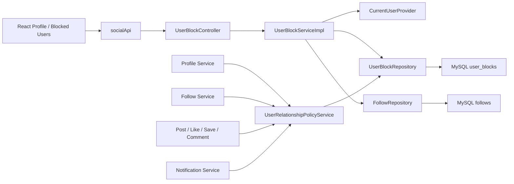
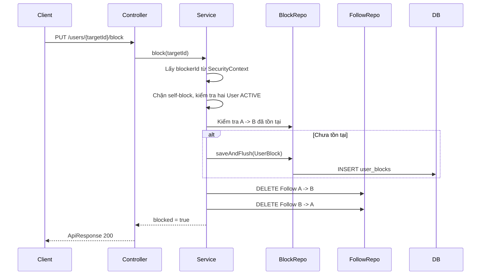

# Phân tích code chức năng User Block

> Tài liệu này giải thích phần code User Block được bổ sung ngày 26/07/2026.
> Đây là tài liệu kỹ thuật hỗ trợ đọc và bảo trì code, không thay thế `README.md`.
> Trạng thái hiện tại: **đang triển khai, chưa sẵn sàng để nghiệm thu hoặc merge**.

---

## 1. Mục đích của tài liệu

Tài liệu giúp người đọc:

- Hiểu yêu cầu nghiệp vụ của User Block.
- Biết dữ liệu Block được lưu ở đâu.
- Hiểu luồng request từ React đến MySQL.
- Biết trách nhiệm của từng class Backend và từng file Frontend.
- Biết Block đã được tích hợp vào module nào.
- Nhận diện các phần còn thiếu hoặc đang lỗi.
- Có hướng sửa đổi mà không phá API, transaction hoặc Cursor Pagination.

Nguồn ưu tiên khi có mâu thuẫn:

1. `README.md`.
2. Yêu cầu User Block của người dùng.
3. SQL và DBML hiện hành.
4. Source code và test.
5. Tài liệu này.

---

## 2. Phạm vi nghiệp vụ

Giả sử User A chặn User B:

- Quan hệ được lưu có hướng `A -> B`.
- Chỉ A có quyền bỏ quan hệ `A -> B`.
- Hiệu lực xem nội dung và tương tác là hai chiều.
- A và B không được xem hồ sơ, bài viết hoặc tương tác với nhau.
- Follow `A -> B` và `B -> A` bị xóa khi Block.
- Không xóa Like, Comment và Save cũ.
- Unblock không phục hồi Follow.
- Block và Unblock phải idempotent.
- Người thực hiện lấy từ JWT, không nhận `blockerId` từ request.
- User Block khác hoàn toàn `users.status = BLOCKED`:
  - User Block là quan hệ giữa hai người dùng.
  - `users.status = BLOCKED` là trạng thái tài khoản do Admin quản lý.

Ngoài phạm vi:

- Restrict.
- Private Account.
- Follow Request.
- Message.

---

## 3. Kiến trúc tổng thể



Điểm quan trọng:

- `UserBlockServiceImpl` xử lý việc tạo/xóa quan hệ Block.
- `UserRelationshipPolicyService` là nơi kiểm tra Block dùng chung.
- Các module khác không nên tự viết lại cách xác định Block.
- Các danh sách có phân trang phải lọc Block ngay trong SQL, không lọc sau khi đã lấy dữ liệu.

---

## 4. Thiết kế Database

### 4.1. Bảng `user_blocks`

Đã thêm vào:

- `database/student_social_network.sql`.
- `database/student_social_network.dbml`.

Schema logic:

```sql
CREATE TABLE user_blocks (
    blocker_id BIGINT UNSIGNED NOT NULL,
    blocked_id BIGINT UNSIGNED NOT NULL,
    created_at DATETIME(6) NOT NULL DEFAULT CURRENT_TIMESTAMP(6),
    PRIMARY KEY (blocker_id, blocked_id),
    KEY idx_user_blocks_blocked_blocker (blocked_id, blocker_id),
    CONSTRAINT fk_user_blocks_blocker
        FOREIGN KEY (blocker_id) REFERENCES users(id)
        ON DELETE CASCADE ON UPDATE RESTRICT,
    CONSTRAINT fk_user_blocks_blocked
        FOREIGN KEY (blocked_id) REFERENCES users(id)
        ON DELETE CASCADE ON UPDATE RESTRICT,
    CONSTRAINT chk_user_blocks_not_self
        CHECK (blocker_id <> blocked_id)
);
```

### 4.2. Ý nghĩa từng ràng buộc

| Thành phần | Ý nghĩa |
|---|---|
| `PRIMARY KEY (blocker_id, blocked_id)` | Một chiều Block chỉ có tối đa một bản ghi, đồng thời chống duplicate do request đồng thời. |
| `idx_user_blocks_blocked_blocker` | Hỗ trợ kiểm tra chiều ngược lại `blocked_id -> blocker_id`. |
| `chk_user_blocks_not_self` | Database không cho người dùng chặn chính mình. |
| Hai foreign key | Bảo đảm hai tài khoản tồn tại. |
| `ON DELETE CASCADE` | Nếu tài khoản bị xóa vật lý, quan hệ Block liên quan được dọn theo convention quan hệ người dùng hiện tại. |
| Không có `status` | Tồn tại bản ghi nghĩa là đang Block. |
| Không có `deleted_at` | Unblock là xóa vật lý quan hệ. |

### 4.3. Cách kiểm tra Block hai chiều

Một cặp user bị xem là có Block khi tồn tại một trong hai bản ghi:

```text
(blocker_id = A AND blocked_id = B)
OR
(blocker_id = B AND blocked_id = A)
```

Không được chỉ kiểm tra `A -> B`, vì hiệu lực nghiệp vụ là hai chiều.

### 4.4. Lưu ý migration

Repository hiện không có Flyway/Liquibase hoặc thư mục migration riêng. SQL canonical là một file dump đầy đủ.

Do đó:

- Code đã cập nhật schema canonical.
- Chưa chạy schema này trên database thật.
- Khi áp dụng lên database đang có dữ liệu, nên tách riêng câu `CREATE TABLE user_blocks`.
- Không chạy lại toàn bộ dump nếu database chứa dữ liệu cần giữ.
- Trước khi áp dụng production cần backup và kiểm tra MySQL version hỗ trợ `CHECK`.

---

## 5. Các class Backend được thêm

### 5.1. `UserBlockId`

Đường dẫn:

`BackEnd/src/main/java/com/stu/edu/vn/backend/user/entity/UserBlockId.java`

Trách nhiệm:

- Ánh xạ composite primary key.
- Chứa `blockerId` và `blockedId`.
- Cài đặt `equals()` và `hashCode()` để JPA nhận diện Entity đúng.

Khi sửa:

- Tên field phải khớp giá trị dùng trong `@MapsId`.
- Tên cột phải tiếp tục khớp SQL và DBML.
- Không bỏ `Serializable`.

### 5.2. `UserBlock`

Đường dẫn:

`BackEnd/src/main/java/com/stu/edu/vn/backend/user/entity/UserBlock.java`

Trách nhiệm:

- Ánh xạ bảng `user_blocks`.
- Liên kết `blocker` và `blocked` đến `User`.
- Không chứa business logic ngoài việc khởi tạo đúng composite key.

Các association dùng `FetchType.LAZY` để tránh tải toàn bộ User khi không cần.

### 5.3. `UserBlockRepository`

Đường dẫn:

`BackEnd/src/main/java/com/stu/edu/vn/backend/user/repository/UserBlockRepository.java`

Các method chính:

```java
existsByIdBlockerIdAndIdBlockedId(blockerId, blockedId)
```

Dùng khi cần kiểm tra đúng một chiều, ví dụ A có trực tiếp chặn B hay không.

```java
existsEitherDirection(userAId, userBId)
```

Dùng cho quyền xem và tương tác. Đây là truy vấn quan trọng nhất của policy.

```java
findBlockedUsers(blockerId, pageable)
```

Chỉ lấy danh sách do current user trực tiếp chặn. Query trả projection tối thiểu và không trả email.

### 5.4. DTO và projection

| File | Mục đích |
|---|---|
| `BlockedUserProjection.java` | Nhận trực tiếp kết quả danh sách từ native query. |
| `BlockedUserResponse.java` | Response gồm `userId`, `displayName`, `avatarUrl`, `blockedAt`. |
| `UserBlockStatusResponse.java` | Response cho Block/Unblock gồm `targetUserId` và `blocked`. |

Không trả `UserBlock` hoặc `User` Entity trực tiếp qua Controller.

### 5.5. `UserRelationshipPolicyService`

Đường dẫn:

- `user/service/UserRelationshipPolicyService.java`.
- `user/service/impl/UserRelationshipPolicyServiceImpl.java`.

API nội bộ:

```java
boolean existsBlockEitherDirection(Long userAId, Long userBId);
boolean hasBlocked(Long blockerId, Long blockedId);
void assertNoBlock(Long userAId, Long userBId);
```

Quy ước sử dụng:

- Dùng `existsBlockEitherDirection` khi cần chuyển lỗi thành 404 riêng của module.
- Dùng `assertNoBlock` khi có thể trả `USER_RELATIONSHIP_BLOCKED`.
- Dùng `hasBlocked` khi chỉ quan tâm đúng chiều.

Không nên inject `UserBlockRepository` trực tiếp vào nhiều service để tự viết lại policy.

### 5.6. `UserBlockServiceImpl`

Đường dẫn:

`BackEnd/src/main/java/com/stu/edu/vn/backend/user/service/impl/UserBlockServiceImpl.java`

#### Luồng Block



Toàn bộ thao tác chạy trong `@Transactional`.

`saveAndFlush()` giúp database phát hiện duplicate composite key ngay trong transaction. Nếu hai request cùng Block đồng thời, code bắt `DataIntegrityViolationException` và kiểm tra lại bản ghi để giữ tính idempotent.

#### Luồng Unblock

- Lấy `blockerId` từ JWT.
- Tạo `UserBlockId(blockerId, targetUserId)`.
- Xóa đúng chiều này.
- Không xóa chiều ngược.
- Không phục hồi Follow.
- Không tạo Notification.
- Trả `blocked = false`.

#### Điểm cần cải thiện

Test concurrency thực tế chưa được bổ sung. Cần xác minh:

- `deleteById()` thật sự idempotent với phiên bản Spring Data đang dùng.
- Race condition không làm transaction thành rollback-only.
- Hai request Block đồng thời không trả 500.

Nếu `deleteById()` phát sinh lỗi khi bản ghi không tồn tại, nên thay bằng một câu `DELETE` có `@Modifying` trả số dòng và bỏ qua kết quả `0`.

### 5.7. `UserBlockController`

Đường dẫn:

`BackEnd/src/main/java/com/stu/edu/vn/backend/user/controller/UserBlockController.java`

API:

| Method | Endpoint | Response |
|---|---|---|
| `PUT` | `/api/v1/users/{targetUserId}/block` | `{targetUserId, blocked: true}` |
| `DELETE` | `/api/v1/users/{targetUserId}/block` | `{targetUserId, blocked: false}` |
| `GET` | `/api/v1/users/me/blocked-users?page=0&size=20` | `PageResponse<BlockedUserResponse>` |

Controller không nhận `blockerId`. Current user được lấy tại service qua `CurrentUserProvider`.

---

## 6. Các Error Code được thêm

File:

`BackEnd/src/main/java/com/stu/edu/vn/backend/common/exception/ErrorCode.java`

| Error code | HTTP | Khi dùng |
|---|---:|---|
| `CANNOT_BLOCK_SELF` | 400 | Current user cố chặn chính mình. |
| `USER_RELATIONSHIP_BLOCKED` | 403 | Hai tài khoản đang có Block và thao tác tương tác bị từ chối. |

Profile và Post Detail cố tình dùng lỗi `PROFILE_NOT_FOUND` hoặc `POST_NOT_FOUND` để tránh tiết lộ tài nguyên của tài khoản có Block.

---

## 7. Những module đã được tích hợp

### 7.1. Profile

File:

`UserProfileServiceImpl.java`

Trước khi tải hồ sơ người khác:

```java
if (!profileUserId.equals(currentUserId)
        && relationshipPolicyService.existsBlockEitherDirection(currentUserId, profileUserId)) {
    throw new BusinessException(ErrorCode.PROFILE_NOT_FOUND);
}
```

Chủ tài khoản vẫn xem hồ sơ của chính mình.

### 7.2. Follow

File:

`FollowServiceImpl.java`

Trước khi tạo Follow:

- Kiểm tra không Follow chính mình.
- Kiểm tra target hợp lệ.
- Gọi `relationshipPolicyService.assertNoBlock(currentUserId, userId)`.

Khi Block, `UserBlockServiceImpl` gọi `deleteFollow` hai lần để xóa cả hai chiều.

### 7.3. Feed và danh sách bài viết

Files:

- `PostRepository.java`.
- `FeedServiceImpl.java`.
- `UserPostServiceImpl.java`.

Các native query được bổ sung `NOT EXISTS` với `user_blocks`. Điều kiện Block nằm trong query trước khi `ORDER BY` và trước khi giới hạn `limit + 1`.

Mục đích:

- Không lấy đủ limit rồi mới lọc bằng Java.
- Không làm trang trả thiếu item khi vẫn còn dữ liệu hợp lệ.
- Không làm `nextCursor` trỏ theo item đã bị lọc.

`findForYouFeed` và `findProfilePosts` được thêm tham số `viewerId`. Đây là thay đổi signature làm một số test cũ bị lỗi và cần được cập nhật.

### 7.4. Post Detail

File:

`PostServiceImpl.java`

Sau khi tìm thấy Post PUBLISHED, service kiểm tra Block giữa viewer và author. Nếu có Block thì trả `POST_NOT_FOUND`.

### 7.5. Like/Unlike

File:

`PostLikeServiceImpl.java`

Service lấy `authorId` qua `PostInteractionTargetProjection`, sau đó gọi policy trước khi tạo hoặc xóa Like.

Lưu ý nghiệp vụ ban đầu chỉ cấm tương tác mới. Việc đang chặn có cho phép Unlike/Unsave dữ liệu cũ hay không cần được test và thống nhất. Code hiện chặn cả Like và Unlike nếu có Block.

### 7.6. Save/Unsave

File:

`SavedPostServiceImpl.java`

Method `assertPostCanBeAccessed()`:

- Kiểm tra Post tồn tại.
- Kiểm tra Post PUBLISHED.
- Kiểm tra Block với tác giả.

Method này được dùng trước Save và Unsave.

### 7.7. Comment/Reply

File:

`CommentServiceImpl.java`

Policy được dùng trước:

- Tạo comment.
- Tạo reply.
- Đọc comment gốc.
- Đọc reply.

Việc lọc comment cũ do chính tài khoản bị Block viết trên bài của người thứ ba chưa được triển khai đầy đủ ở repository.

### 7.8. Search User

Files:

- `SearchUserProfileRepository.java`.
- `SearchServiceImpl.java`.

Search User lọc Block trực tiếp trong cả query dữ liệu và `countQuery`. `viewerId` được bind từ current user.

### 7.9. Notification

Files:

- `NotificationServiceImpl.java`.
- `NotificationRepository.java`.

Khi tạo Notification:

- Nếu actor bằng recipient thì bỏ qua như trước.
- Nếu actor và recipient có Block theo bất kỳ chiều nào thì không lưu Notification.

Khi đọc danh sách:

- Native query loại Notification có actor đang Block với recipient.
- Notification hệ thống có `actor_id IS NULL` vẫn được trả.

Điểm còn thiếu:

- Query unread count hiện chưa áp dụng cùng điều kiện Block.
- Các thao tác đọc/xóa từng Notification cũ chưa xác minh policy actor.

---

## 8. Frontend

### 8.1. API endpoint

File:

`FrontEnd/src/api/apiEndpoints.js`

Đã thêm:

```javascript
block: (userId) => `/api/v1/users/${encodeURIComponent(userId)}/block`
blockedUsers: '/api/v1/users/me/blocked-users'
```

### 8.2. API service

File:

`FrontEnd/src/api/socialApi.js`

Đã thêm:

```javascript
blockUser(userId, signal)
unblockUser(userId, signal)
getBlockedUsers(params, signal)
```

React component không gọi Axios trực tiếp.

### 8.3. Block trên trang Profile

File:

`FrontEnd/src/features/profile/pages/ProfilePage.jsx`

Luồng hiện tại:

1. Nút “Chặn” chỉ nằm trong khu vực action của hồ sơ người khác.
2. Nhấn nút mở modal xác nhận.
3. Khi submit, nút bị disable bằng state `blocking`.
4. Gọi `socialApi.blockUser(profile.id)`.
5. Thành công thì đóng modal và điều hướng về `/feed/for-you`.
6. Thất bại thì dùng error state hiện có.

Điểm còn thiếu:

- Chưa có toast thành công.
- Chưa có cache invalidation tập trung cho Feed, Search và Follow.
- UI hiện dùng nút trực tiếp thay vì một menu action hoàn chỉnh.
- Chưa có test component.

### 8.4. Trang tài khoản đã chặn

File:

`FrontEnd/src/features/profile/pages/BlockedUsersPage.jsx`

Route:

`/settings/blocked-users`

Màn hình hỗ trợ:

- Loading state.
- Empty state.
- Error state.
- Danh sách avatar và display name.
- Phân trang.
- Modal xác nhận Unblock.
- Disable trong khi request đang xử lý.
- Xóa item khỏi danh sách hiện tại sau khi Unblock.

Điểm còn thiếu:

- Chưa thêm link điều hướng rõ ràng từ menu cài đặt/UserShell.
- Nếu xóa item cuối trang, chưa tự lùi về trang trước hoặc tải lại tổng số.
- Chưa có toast thành công.
- Chưa có test accessibility/modal.

### 8.5. Router

Files:

- `FrontEnd/src/router/lazyRoutes.jsx`.
- `FrontEnd/src/router/index.jsx`.

Trang Blocked Users được lazy-load và nằm trong `ProtectedRoute`.

---

## 9. Danh sách file đã thêm

### Backend

- `user/controller/UserBlockController.java`.
- `user/dto/response/BlockedUserResponse.java`.
- `user/dto/response/UserBlockStatusResponse.java`.
- `user/entity/UserBlock.java`.
- `user/entity/UserBlockId.java`.
- `user/repository/BlockedUserProjection.java`.
- `user/repository/UserBlockRepository.java`.
- `user/service/UserBlockService.java`.
- `user/service/UserRelationshipPolicyService.java`.
- `user/service/impl/UserBlockServiceImpl.java`.
- `user/service/impl/UserRelationshipPolicyServiceImpl.java`.

### Frontend

- `features/profile/pages/BlockedUsersPage.jsx`.

### Tài liệu

- `docs/USER-BLOCK-CODE-WALKTHROUGH.md`.

---

## 10. Danh sách file đã sửa

### Database

- `database/student_social_network.sql`.
- `database/student_social_network.dbml`.

### Backend

- `common/exception/ErrorCode.java`.
- `feed/service/impl/FeedServiceImpl.java`.
- `follow/service/impl/FollowServiceImpl.java`.
- `interaction/service/impl/CommentServiceImpl.java`.
- `notification/repository/NotificationRepository.java`.
- `notification/service/impl/NotificationServiceImpl.java`.
- `post/repository/PostRepository.java`.
- `post/service/impl/PostLikeServiceImpl.java`.
- `post/service/impl/PostServiceImpl.java`.
- `post/service/impl/SavedPostServiceImpl.java`.
- `post/service/impl/UserPostServiceImpl.java`.
- `search/repository/SearchUserProfileRepository.java`.
- `search/service/impl/SearchServiceImpl.java`.
- `user/service/impl/UserProfileServiceImpl.java`.

### Frontend

- `src/api/apiEndpoints.js`.
- `src/api/socialApi.js`.
- `src/features/profile/pages/ProfilePage.jsx`.
- `src/router/index.jsx`.
- `src/router/lazyRoutes.jsx`.

---

## 11. Kết quả kiểm tra hiện tại

Các lệnh đã chạy:

```powershell
cd BackEnd
mvn -q -DskipTests compile
```

Kết quả: thành công.

```powershell
cd FrontEnd
npm.cmd run lint
npm.cmd run build
```

Kết quả:

- ESLint thành công.
- Production build thành công.

```powershell
cd BackEnd
mvn test -q
```

Kết quả:

- Tổng test được báo cáo: 579.
- Failure assertion: 0.
- Error runtime/setup: 90.
- Skipped: 39.
- Test suite thất bại.

Nguyên nhân chính:

- Test cũ gọi constructor service với danh sách dependency cũ.
- Test cũ mock repository method có signature cũ.
- Các class bị ảnh hưởng gồm Profile, Post, Save, Comment, Notification, Follow, Search và Feed.
- Test Block mới chưa được bổ sung.

Không được hiểu “Backend compile thành công” là “chức năng đã hoàn chỉnh”. Test suite vẫn đỏ.

---

## 12. Các phần bắt buộc còn thiếu

### 12.1. Backend

- Lọc Block cho Search Post, bao gồm `countQuery`.
- Lọc Block cho follower/following list.
- Kiểm tra đầy đủ tất cả query Feed For You, Following, Profile Posts, Liked và Saved.
- Đồng bộ unread notification count với danh sách notification.
- Quyết định và test hành vi Unlike/Unsave khi đang Block.
- Hoàn thiện kiểm soát comment cũ của tài khoản bị Block.
- Bổ sung test race condition Block.
- Bổ sung controller/security test cho ba endpoint.
- Xác minh API yêu cầu ACTIVE và profile completed theo guard hiện tại.

### 12.2. Frontend

- Thêm link “Tài khoản đã chặn” vào khu vực cài đặt.
- Toast thành công cho Block và Unblock.
- Invalidate hoặc làm mới Feed/Search/follower/following.
- Xử lý trang rỗng sau khi Unblock item cuối.
- Viết test UI.

### 12.3. Tài liệu

- Chỉ cập nhật `README.md` thành `IMPLEMENTED` sau khi test xanh.
- Bổ sung API Block vào danh sách API chính thức.
- Ghi rõ User Block khác Admin account status `BLOCKED`.

---

## 13. Thứ tự sửa tiếp theo đề xuất

1. Cập nhật constructor và mock trong test cũ để test suite chạy lại bình thường.
2. Viết unit test riêng cho `UserBlockServiceImpl`.
3. Viết controller/security test cho API Block.
4. Hoàn thiện tất cả native query có phân trang.
5. Viết repository contract test để bắt buộc có `NOT EXISTS user_blocks`.
6. Viết integration test MySQL cho Cursor Pagination.
7. Hoàn thiện UI cache/toast/navigation.
8. Chạy lại compile, unit test, integration test, package, lint và build.
9. Chỉ khi tất cả đạt mới cập nhật trạng thái trong `README.md`.

---

## 14. Hướng dẫn sửa code an toàn

### Thêm một module mới cần kiểm tra Block

Ưu tiên:

```java
relationshipPolicyService.assertNoBlock(currentUserId, targetUserId);
```

Nếu API cần che giấu tài nguyên:

```java
if (relationshipPolicyService.existsBlockEitherDirection(currentUserId, ownerId)) {
    throw new BusinessException(ErrorCode.POST_NOT_FOUND);
}
```

Không làm:

```java
userBlockRepository.findAll().stream().filter(...);
```

Không viết mỗi module một định nghĩa Block khác nhau.

### Sửa query Cursor Pagination

Điều kiện Block phải nằm trong query trước `ORDER BY` và trước khi Spring áp giới hạn:

```sql
AND NOT EXISTS (
    SELECT 1
    FROM user_blocks ub
    WHERE (ub.blocker_id = :viewerId AND ub.blocked_id = p.author_id)
       OR (ub.blocker_id = p.author_id AND ub.blocked_id = :viewerId)
)
```

Sau khi sửa:

- Giữ nguyên thứ tự sort.
- Giữ nguyên các khóa cursor.
- Vẫn lấy `limit + 1`.
- Không lọc lại bằng Java.
- Cập nhật cả method signature, service call và test mock.

### Sửa Search dùng PageResponse

Phải thêm cùng điều kiện vào:

- Query lấy dữ liệu.
- `countQuery`.

Nếu chỉ sửa query dữ liệu, `totalElements` và `totalPages` sẽ sai.

### Thêm API mới

Luôn giữ:

- Current user từ `CurrentUserProvider`.
- DTO response, không trả Entity.
- `ApiResponse` chung.
- `PageResponse` cho danh sách page-based.
- Validation ở Service.
- Controller mỏng.

### Sửa Frontend

Luôn đặt request trong API service. Component chỉ:

- Quản lý state giao diện.
- Gọi service.
- Hiển thị loading/error/success.
- Điều hướng và cập nhật cache.

Không gọi `httpClient` hoặc Axios trực tiếp trong JSX.

---

## 15. Checklist test cần bổ sung

### UserBlockService

- Không chặn chính mình.
- Block user hợp lệ.
- Block lặp lại.
- Unblock hợp lệ.
- Unblock lặp lại.
- Block xóa Follow hai chiều.
- Hai request Block đồng thời.
- Danh sách chỉ thuộc current user.
- Response không có email.

### Tích hợp module

- Follow bị từ chối khi có Block ở mỗi chiều.
- Profile trả 404 ở mỗi chiều.
- Post Detail trả 404 ở mỗi chiều.
- Like, Comment và Save bị từ chối.
- Feed không trả post bị Block.
- Cursor vẫn đủ limit và đúng `nextCursor`.
- Search User/Post không trả dữ liệu bị Block.
- Notification không được tạo.
- Notification cũ không xuất hiện trong list và unread count.

### Frontend

- Không hiện Block cho hồ sơ của chính mình.
- Modal có nội dung đúng.
- Không gửi hai request khi double click.
- API dùng đúng method/path.
- Thành công thì điều hướng và làm mới cache.
- Danh sách Block có loading/empty/error/page.
- Unblock xóa đúng item và không tự Follow.

---

## 16. Trạng thái cuối tại thời điểm viết

| Hạng mục | Trạng thái |
|---|---|
| SQL/DBML | Đã thêm schema, chưa chạy database thật |
| Backend compile | Thành công |
| API Block cơ bản | Đã có code |
| Policy dùng chung | Đã có code |
| Tích hợp toàn bộ module | Chưa hoàn tất |
| Backend test | Thất bại, 90 errors |
| Frontend lint | Thành công |
| Frontend build | Thành công |
| Frontend test Block | Chưa có |
| README chính thức | Chưa cập nhật |
| Sẵn sàng manual test | Chưa |

Kết luận: code hiện tại là nền tảng triển khai User Block và tài liệu này phản ánh đúng trạng thái source, nhưng cần hoàn thiện các mục ở phần 12 và làm test suite xanh trước khi coi chức năng là hoàn chỉnh.
