# Walkthrough code Auth

> Tài liệu này mô tả code đang tồn tại sau đợt refactor ngày 21/07/2026. Nguồn nghiệp vụ cao nhất vẫn là `README.md`; request/response chi tiết nằm tại `docs/data/API-CONTRACT.md`.

## 1. Tổng quan module Auth

Module Auth chứng minh người gọi là ai, tạo và duy trì phiên đăng nhập, quản lý các phương thức đăng nhập của cùng một tài khoản và chặn người dùng chưa hoàn tất onboarding khỏi API mạng xã hội. Hệ thống chỉ có ba phương thức: `EMAIL`, `GOOGLE`, `FACEBOOK`.

- EMAIL: mật khẩu + email đã xác minh bằng OTP.
- GOOGLE: Frontend lấy ID token, Backend tự xác minh với Google.
- FACEBOOK: Frontend lấy access token, Backend tự xác minh với Facebook.
- Sau xác thực, API nghiệp vụ chỉ nhận JWT Access Token do Backend phát hành.

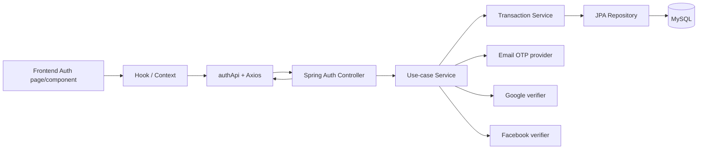

Nguyên tắc quan trọng: lời gọi email/Google/Facebook nằm ngoài transaction database; transaction service chỉ khóa, kiểm tra và ghi dữ liệu.

## 2. Bản đồ thư mục

### Backend

| Package | Trách nhiệm | File tiêu biểu |
|---|---|---|
| `auth/controller` | HTTP adapter, validate DTO, gọi service, bọc `ApiResponse` | `AuthController`, `PasswordRecoveryController`, `AuthMethodController` |
| `auth/dto` | Contract request/response, Bean Validation | `RegisterRequest`, `LoginResponse`, `ReauthenticationRequest` |
| `auth/service` | Use case, điều phối provider và transaction | `RegistrationServiceImpl`, `AuthServiceImpl`, `SocialAuthenticationTransactionService` |
| `auth/repository` | Query và pessimistic lock | `PendingRegistrationRepository`, `RefreshTokenRepository` |
| `auth/entity` | Trạng thái lưu DB và state transition | `PendingRegistration`, `RefreshToken`, `PasswordRecoveryChallenge` |
| `auth/enums` | Trạng thái/phương thức nghiệp vụ | `AuthMethod`, `AuthProvider`, `OtpChallengeStatus` |
| `auth/crypto`, `generator` | HMAC, OTP và flow token ngẫu nhiên | `AuthHmacService`, `SecureRandomOtpGenerator` |
| `auth/delivery` | Gửi OTP và ghi nhận kết quả | `ProviderRegistrationOtpSender`, `PasswordRecoveryOtpListener` |
| `auth/google`, `auth/facebook` | Xác minh token chính thức với provider | `OfficialGoogleIdentityVerifier`, `OfficialFacebookAccessTokenVerifier` |
| `security` | JWT filter, token hash, rate limit, public paths | `JwtAuthenticationFilter`, `JwtService`, `AuthRateLimitFilter` |
| `user/...Onboarding...` | Tích hợp trực tiếp sau khi Auth tạo user | `UserOnboardingController`, `UserOnboardingServiceImpl` |

### Frontend

| Thư mục | Trách nhiệm | File tiêu biểu |
|---|---|---|
| `features/auth/pages` | Màn hình theo route | `LoginPage`, `RegisterPage`, `AuthProvidersPage` |
| `features/auth/components` | Form/dialog Auth | `AuthForm`, `OtpInput`, `LinkEmailDialog` |
| `features/auth/hooks` | State machine và side effect của UI | `useLogin`, `usePasswordRecovery`, `useLinkAuthProvider` |
| `features/auth/services` | Use-case client và chuẩn hóa response | `authService`, `registrationService` |
| `features/auth/google`, `facebook` | SDK adapter/hook provider | `useGoogleAuth`, `facebookSdkAdapter` |
| `features/auth/validation` | Validation trải nghiệm phía Client | `loginValidation`, `registrationValidation` |
| `contexts` | Phiên toàn ứng dụng và pending registration | `AuthContext`, `RegistrationContext` |
| `api` | Endpoint, Axios, token storage, error normalization | `authApi`, `httpClient`, `tokenManager` |
| `router` | Route và guard theo session/onboarding/role | `index.jsx`, `routeGuards.jsx` |

## 3. Kiến trúc Backend

### Controller

Controller không truy cập repository và không quyết định nghiệp vụ. Ví dụ `AuthController.startRegistration()` nhận `RegisterRequest`, gọi `RegistrationService.start()` rồi trả HTTP 202. IP được lấy qua `ClientIpAddressResolver`, không tin header tùy ý trong service.

### DTO

DTO khóa contract HTTP và ngăn trả Entity. Request dùng Bean Validation; service vẫn kiểm tra quy tắc liên field như password/confirmPassword. Response Auth chỉ trả token thô ở đúng thời điểm phát hành; hash không được trả.

### Service

Có hai vai trò:

1. Service điều phối như `RegistrationServiceImpl`: validate → transaction ghi pending → gửi email ngoài transaction → transaction ngắn ghi delivery status.
2. Transaction service như `RegistrationVerificationTransactionService`: dùng `@Transactional`, pessimistic lock, state transition và rollback.

Các interface service được giữ lại vì Controller test mock qua contract và vì chúng biểu diễn use case. Các class ngắn như Google/Facebook service vẫn cần thiết để tách external verification khỏi transaction.

### Repository và Entity

Repository đặt query lock rõ nghĩa (`find...ForUpdate`). Entity giữ invariant trạng thái qua method như `expire`, `complete`, `revoke`; code ngoài entity không tự sửa rời rạc các trường lifecycle.

### Provider

`OfficialGoogleIdentityVerifier` và `OfficialFacebookAccessTokenVerifier` tự xác minh credential. `RegistrationOtpSender` là boundary gửi OTP email. Backend không tin email/provider ID do Frontend tự khai báo.

### Security/JWT

`JwtAuthenticationFilter` đọc Bearer Access Token, dùng `JwtService` verify chữ ký/expiry và tạo principal. `RefreshTokenIssuer` sinh Refresh Token ngẫu nhiên, chỉ lưu SHA-256 hash. `SecurityConfig` và `SecurityPaths` công khai đúng endpoint Auth cần thiết; endpoint quản lý provider yêu cầu JWT.

## 4. Kiến trúc Frontend

- Page ghép component và quyết định điều hướng, không gọi Axios trực tiếp.
- Component chỉ thu input/hiển thị state; ví dụ `LinkEmailDialog` chỉ hỗ trợ email.
- Hook giữ operation lock, AbortController, loading/error và state machine.
- Service gọi `authApi`, kiểm tra response tối thiểu và lưu metadata cần thiết.
- `AuthContext` giữ trạng thái phiên toàn app; `RegistrationContext` giữ pending registration.
- `httpClient` gắn Access Token, xử lý đúng một retry và gom request refresh đồng thời vào một Promise.
- `tokenManager`: Access Token ở memory; Refresh Token và session snapshot ở `sessionStorage`.
- `routeGuards`: phân biệt guest, authenticated-incomplete, authenticated-complete và ADMIN.

## 5. Giải thích từng luồng code

### 5.1 Đăng ký email và gửi OTP

| Mục | Diễn giải |
|---|---|
| A | Tạo pending registration; chưa tạo user/JWT. |
| B | Người dùng nhập email, password, confirmPassword tại `RegisterPage`. |
| C | `RegisterPage` → `useRegistration` → `RegistrationContext.startRegistration` → `registrationService.startRegistration` → `authApi.startRegistration`. |
| D | `POST /api/v1/auth/registrations`: `{email,password,confirmPassword}`. |
| E | `AuthController.startRegistration`. |
| F | `RegistrationServiceImpl.start` và `RegistrationTransactionService.create`. |
| G | `PendingRegistrationRepository`, `UserRepository`, `RegistrationOtpSender`. |
| H | Đọc `users`; ghi/resume `pending_registrations`. |
| I | HTTP 202 với flow token, email che, expiry/cooldown/nextStep. |
| J | Lưu flow vào `sessionStorage`, chuyển `/register/verify`. |
| K | Email tồn tại, password yếu, pending race, delivery failed/unknown. |
| L | Breakpoint: `RegistrationContext.startRegistration`, `RegistrationServiceImpl.start`, `RegistrationTransactionService.create`. |

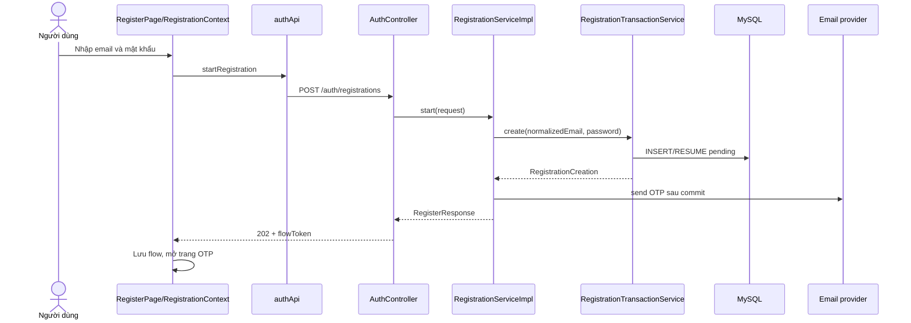

### 5.2 Xác minh OTP đăng ký

| Mục | Diễn giải |
|---|---|
| A | OTP hợp lệ mới tạo `users`, `user_profiles` và phiên. |
| B | Nhập mã tại `VerifyRegistrationOtpPage`. |
| C | Page → `RegistrationContext.verifyOtp` → `registrationService.verifyOtp` → `authApi.verifyRegistrationOtp`. |
| D | `POST /registrations/verify`: flow token, code và metadata thiết bị. |
| E | `AuthController.verifyRegistration`. |
| F | `RegistrationVerificationServiceImpl.verify` → `RegistrationVerificationTransactionService.verify`. |
| G | Pending/User/Profile repositories, `AuthHmacService`, `RefreshTokenIssuer`, `JwtService`. |
| H | Khóa/đọc pending; ghi user, profile, refresh token; complete pending trong cùng transaction. |
| I | Access Token, Refresh Token, user summary, `profileCompleted=false`. |
| J | `AuthContext.setAuthenticatedSession`, xóa flow, chuyển onboarding. |
| K | Flow sai/hết hạn, OTP sai/hết hạn/đủ 5 lần, email vừa bị chiếm, rollback profile/token. |
| L | Breakpoint: `RegistrationContext.verifyOtp`, `RegistrationVerificationTransactionService.verify`, `PendingRegistration.complete`. |

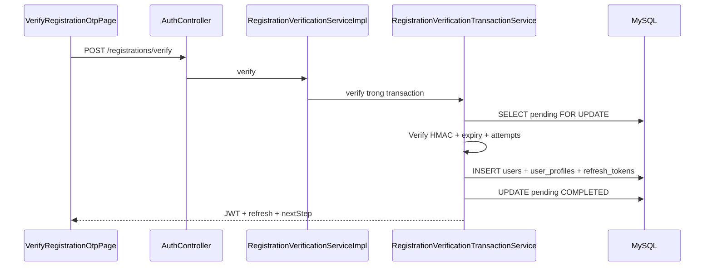

### 5.3 Status, resend và cancel registration

| Mục | Diễn giải |
|---|---|
| A | Khôi phục pending, xoay OTP khi được phép hoặc kết thúc pending. |
| B | Reload trang OTP, bấm gửi lại hoặc hủy. |
| C | `RegistrationContext.restoreFlow/resendOtp/cancelRegistration` → `registrationService` → `authApi`. |
| D | Status dùng header flow token; resend/cancel dùng `{registrationFlowToken}` theo contract hiện tại. |
| E | Ba method tương ứng trong `AuthController`. |
| F | `RegistrationLifecycleServiceImpl` → `RegistrationLifecycleTransactionService`. |
| G | `PendingRegistrationRepository`, sender khi resend. |
| H | Đọc/khóa/update `pending_registrations`. |
| I | Metadata trạng thái; resend trả expiry mới; cancel trả trạng thái terminal. |
| J | Cập nhật flow hoặc xóa flow và quay về đăng ký. |
| K | Cooldown, terminal state, token invalid/expired. |
| L | Breakpoint: `RegistrationLifecycleTransactionService.issueNewOtp/status/cancel`. |

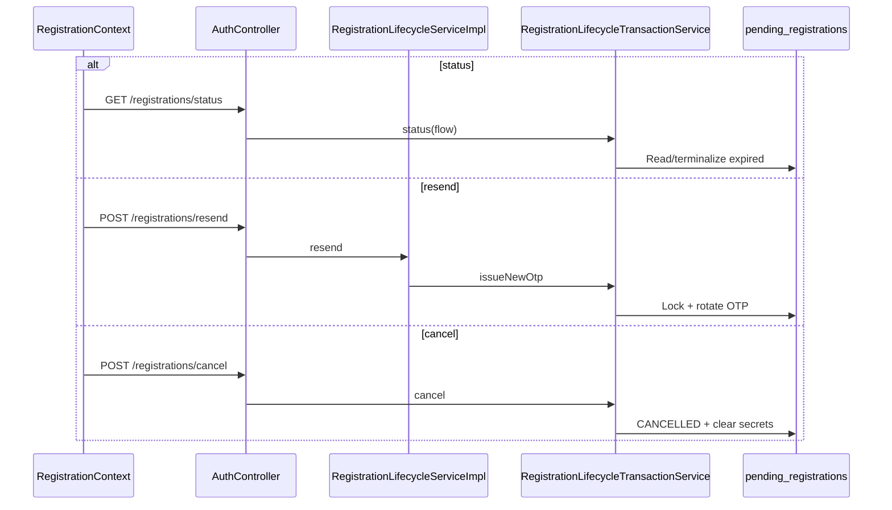

### 5.4 Đăng nhập local

| Mục | Diễn giải |
|---|---|
| A | Đăng nhập bằng email verified và password. |
| B | `LoginPage` nhập email/password. |
| C | `useLogin` → `AuthContext.login` → `authService.loginLocal` → `authApi.login`. |
| D | `POST /auth/login`: email, password, device metadata. |
| E | `AuthController.login`. |
| F | `AuthServiceImpl.login`. |
| G | User/Profile repositories, PasswordEncoder, RefreshTokenIssuer, JwtService. |
| H | Đọc users/profile; ghi refresh_tokens. |
| I | JWT, Refresh Token, user/role, profileCompleted. |
| J | Persist session; về onboarding, admin hoặc feed qua `getSafeReturnPath/getAuthenticatedHome`. |
| K | Invalid credentials, unverified email, social-only, blocked, profile missing. |
| L | Breakpoint: `useLogin`, `AuthServiceImpl.login`, `RefreshTokenIssuer.issue`. |

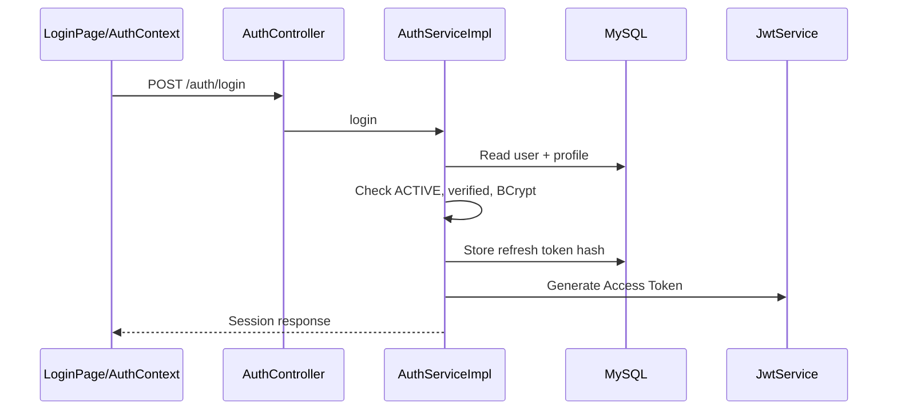

### 5.5 Google và Facebook

| Mục | Diễn giải |
|---|---|
| A | Xác minh social credential và đăng nhập/tạo/link đúng account. |
| B | Bấm nút Google/Facebook. |
| C | Provider hook → SDK adapter → `googleAuthService/facebookAuthService` → `authApi`. |
| D | Google `{idToken}`; Facebook `{accessToken}`; có thể kèm registration flow header. |
| E | `AuthController.googleAuth/facebookAuth`. |
| F | `GoogleAuthServiceImpl` hoặc `FacebookAuthServiceImpl`; sau verify gọi transaction service. |
| G | Official verifier, provider/pending/user/profile/refresh repositories. |
| H | Đọc/ghi `user_auth_providers`, có thể tạo users/profile, xử lý pending, tạo refresh token. |
| I | Session hoặc lỗi conflict có details/token. |
| J | Thiết lập session rồi onboarding/home; conflict chuyển `/auth/social-conflict`. |
| K | Provider token invalid/expired, email conflict, provider đã thuộc user khác, blocked. |
| L | Breakpoint: provider hook, official verifier, `SocialAuthenticationTransactionService.authenticate`. |

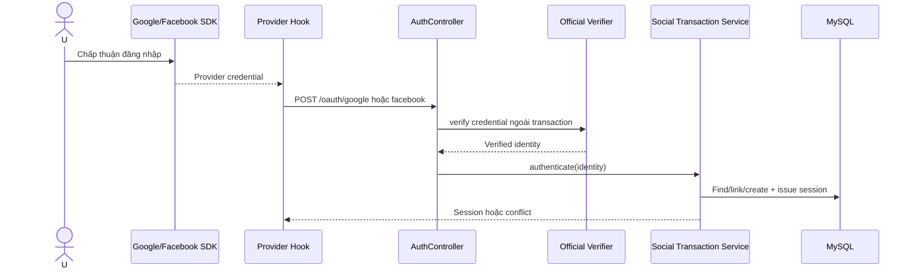

### 5.6 Social conflict

| Mục | Diễn giải |
|---|---|
| A | Không tự động gộp hai tài khoản/pending khác email; Facebook account riêng không kế thừa role/quyền account trùng email. |
| B | Chọn tiếp tục OTP, hủy pending để dùng social, đăng nhập account cũ hoặc tạo Facebook-only account riêng khi Backend cho phép. |
| C | `SocialConflictPendingPage` → `useSocialConflict` → `socialConflictService.resolve`. |
| D | Header social conflict token + `{action}`. |
| E | `AuthController.resolveSocialConflict`. |
| F | `SocialConflictResolutionServiceImpl.resolve`. |
| G | Social challenge, pending, user/provider repositories và RefreshTokenIssuer. |
| H | Khóa `social_auth_challenges`/pending; cancel hoặc giữ pending; có thể tạo Facebook-only `USER` với `users.email = NULL` và session trong cùng transaction. |
| I | `resolved`, nextStep hoặc session. |
| J | Tiếp tục OTP, hoặc thiết lập session và onboarding/home. |
| K | Token expired/used, action không được phép, pending terminal. |
| L | Breakpoint: `socialConflictService.resolve`, `SocialConflictResolutionServiceImpl.resolve`. |

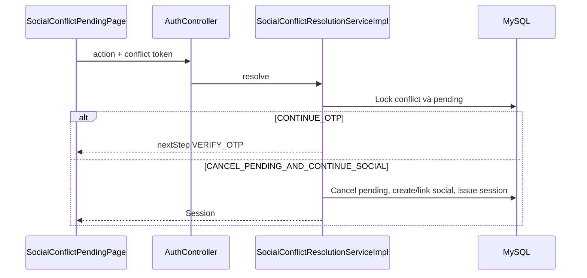

### 5.7 Refresh Token

| Mục | Diễn giải |
|---|---|
| A | Đổi Refresh Token hợp lệ lấy cặp token mới; token cũ bị revoke. |
| B | Tự chạy khi bootstrap hoặc interceptor nhận `ACCESS_TOKEN_EXPIRED`. |
| C | `httpClient`/`AuthContext.refreshSession` → `authService.refreshSession` → `authApi.refreshToken`. |
| D | `POST /auth/refresh-token`: `{refreshToken}`. |
| E | `AuthController.refreshToken`. |
| F | `AuthServiceImpl.refreshAccessToken`. |
| G | Refresh/User/Profile repositories, TokenHashService, JwtService, RefreshTokenIssuer. |
| H | Lock refresh token, revoke cũ, insert token hash mới. |
| I | Access/Refresh Token mới và profileCompleted. |
| J | Cập nhật tokenManager; retry request đúng một lần. |
| K | Invalid/expired/revoked, blocked, rotation failure. |
| L | Breakpoint: response interceptor, `authService.refreshSession`, `AuthServiceImpl.refreshAccessToken`. |

### 5.8 Logout

| Mục | Diễn giải |
|---|---|
| A | Thu hồi phiên refresh hiện tại và luôn xóa session local. |
| B | Bấm đăng xuất. |
| C | `AuthContext.logout` → `authService.logout` → `authApi.logout`. |
| D | `POST /auth/logout`: `{refreshToken}`. |
| E | `AuthController.logout`. |
| F | `AuthServiceImpl.logout`. |
| G | `RefreshTokenRepository.findByTokenHashForUpdate`. |
| H | Update `refresh_tokens.revoked_at`; lặp lại vẫn thành công. |
| I | `{success:true}`. |
| J | `finally` xóa Access/Refresh/snapshot và về login. |
| K | Token invalid hoặc DB failure; local session vẫn bị xóa. |
| L | Breakpoint: `AuthContext.logout`, `AuthServiceImpl.logout`. |

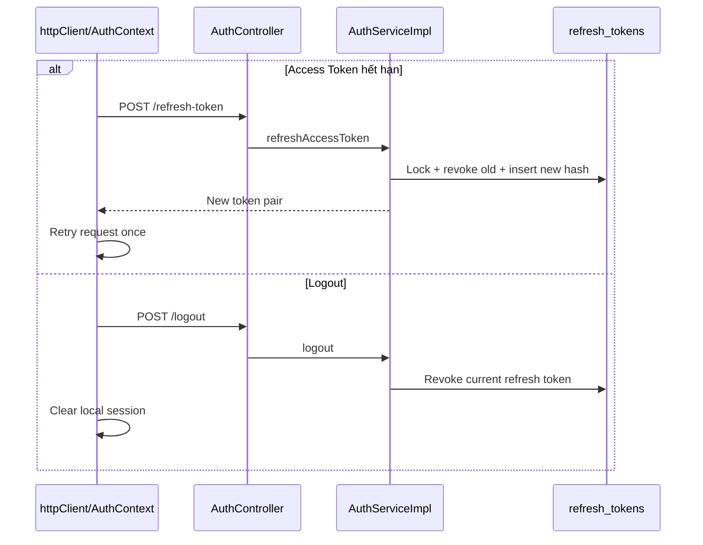

### 5.9 Forgot password, verify và reset password

| Mục | Diễn giải |
|---|---|
| A | Reset password cho local account đủ điều kiện mà không lộ email tồn tại hay không. |
| B | Nhập email → thông báo trung tính → người dùng xác nhận đã nhận mã → OTP → password mới. |
| C | Pages → `PasswordRecoveryProvider/usePasswordRecovery` → `passwordRecoveryService` → `authApi`. |
| D | Start `{email}`; verify `{code}` + flow header; complete password pair + reset-token header. |
| E | Bốn method trong `PasswordRecoveryController`. |
| F | `PasswordRecoveryServiceImpl.start/verify/resend/complete`. |
| G | Challenge/User/Refresh repositories, HMAC, PasswordEncoder, async OTP event. |
| H | Ghi/khóa `password_recovery_challenges`; complete cập nhật `users.password_hash` và revoke toàn bộ refresh token. |
| I | Start luôn trung tính; verify thật trả resetAuthorizedToken; complete không tự login. |
| J | `/forgot-password` không tự mở form OTP; chỉ mở sau nút “Tôi đã nhận được mã”, sau đó `/reset-password` và về login. |
| K | Decoy, OTP sai/hết hạn/locked, flow rotated, reset token used/expired. |
| L | Breakpoint: `usePasswordRecovery`, `PasswordRecoveryServiceImpl.start/verify/complete`, `PasswordRecoveryOtpListener`. |

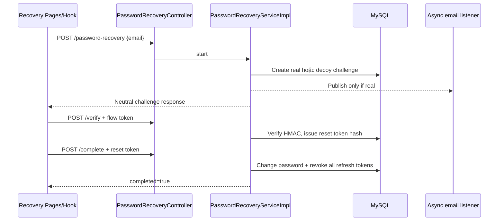

### 5.10 Liên kết EMAIL/GOOGLE/FACEBOOK

| Mục | Diễn giải |
|---|---|
| A | Thêm phương thức vào user lấy từ JWT hiện tại. |
| B | Tại `AuthProvidersPage`, mở `LinkEmailDialog` hoặc provider popup. |
| C | Page → `useLinkAuthProvider` → `authProviderService` → `authApi`. |
| D | Email `{email}` rồi OTP + link flow header; social gửi provider credential. |
| E | `AuthMethodController.startEmail/verifyEmail/resendEmail/linkGoogle/linkFacebook`. |
| F | `AuthMethodManagementServiceImpl`, transaction link tương ứng. |
| G | Official verifier, link challenge/user/provider repositories, OTP sender. |
| H | `auth_method_link_challenges`, `users.email*`, `user_auth_providers`. |
| I | Link challenge hoặc `AuthMethodResponse`. |
| J | Dialog OTP hoặc refetch danh sách provider. |
| K | Method đã link, identifier/provider thuộc user khác, challenge/cooldown lỗi. |
| L | Breakpoint: `useLinkAuthProvider.startEmailLink/linkSocial`, `AuthMethodLinkTransactionService`, `SocialProviderLinkTransactionService`. |

### 5.11 Reauthentication và gỡ provider

| Mục | Diễn giải |
|---|---|
| A | Yêu cầu bằng chứng mới trước thao tác gỡ phương thức; không gỡ phương thức cuối cùng. |
| B | Chọn unlink, xác nhận, nhập password hoặc xác thực social. |
| C | `ReauthenticationDialog` → `useLinkAuthProvider.unlinkWithProof` → reauthenticate rồi unlink. |
| D | Reauth: method/purpose/target + proof; unlink: DELETE + reauthentication token header. |
| E | `ReauthenticationController.reauthenticate`; `AuthMethodController.unlink`. |
| F | `ReauthenticationServiceImpl/TransactionService`; `AuthMethodUnlinkTransactionService`. |
| G | Provider verifier, challenge/user/provider repositories, HMAC. |
| H | Ghi/consume `reauthentication_challenges`; xóa provider hoặc clear local method. |
| I | Opaque reauthentication token, sau đó HTTP 204. |
| J | Refetch danh sách; lỗi mơ hồ cũng refetch để đồng bộ server truth. |
| K | Proof sai, token expired/used/wrong scope, last method, method không tồn tại. |
| L | Breakpoint: `unlinkWithProof`, `ReauthenticationServiceImpl.reauthenticate`, `AuthMethodUnlinkTransactionService.unlink`. |

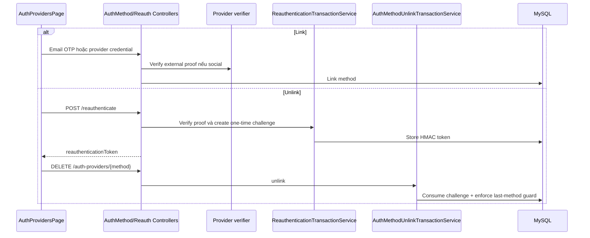

### 5.12 Onboarding redirect

| Mục | Diễn giải |
|---|---|
| A | User thật nhưng chưa đủ hồ sơ chỉ dùng Auth/onboarding. |
| B | Sau login/social/OTP, nhập username duy nhất, display name, ngày sinh và thông tin tùy chọn. |
| C | `routeGuards` → `OnboardingProfilePage` → onboarding service; hoàn tất gọi `AuthContext.updateProfileCompletion`. |
| D | `GET/PUT /api/v1/users/me/onboarding` và `GET .../username-availability` với JWT. |
| E | `UserOnboardingController`. |
| F | `UserOnboardingServiceImpl`. |
| G | User/Profile repositories và avatar service nếu có. |
| H | Đọc/ghi `user_profiles.username`, dữ liệu hồ sơ và `profile_completed_at`; username không lưu `@`. |
| I | Trạng thái/profile đã hoàn tất. |
| J | Snapshot đổi thành completed, chuyển `/onboarding/success` rồi home. |
| K | Dưới 18 tuổi, thiếu field, username invalid/reserved/duplicate/race, token/session lỗi, `PROFILE_NOT_COMPLETED`. |
| L | Breakpoint: `ProfileCompletionRoute`, `OnboardingProfilePage`, `UserOnboardingServiceImpl.completeOnboarding`. |

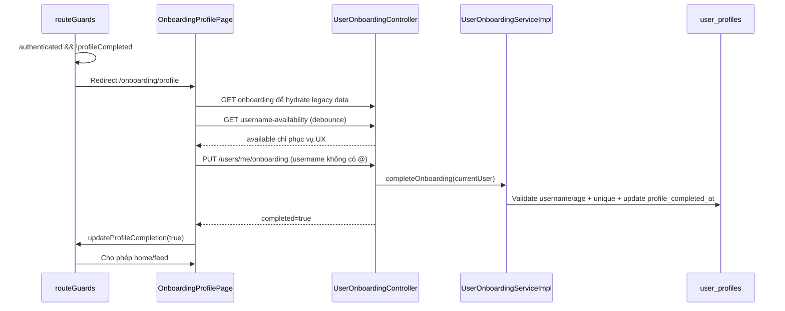

## 6. Sơ đồ luồng

Các sequence diagram được đặt ngay dưới luồng tương ứng ở mục 5 để khi đọc có thể đối chiếu A–L mà không phải chuyển trang. Tài liệu có sơ đồ cho: đăng ký/gửi OTP, verify OTP, status-resend-cancel, login, Google/Facebook, social conflict, refresh/logout, password recovery, link-unlink-reauthentication và onboarding.

## 7. Bảng “File này dùng để làm gì”

| File | Trách nhiệm | Được gọi bởi | Gọi đến | Dữ liệu |
|---|---|---|---|---|
| `FrontEnd/src/api/authApi.js` | HTTP Auth duy nhất | Auth services | `httpClient` | DTO JSON, flow header |
| `FrontEnd/src/api/httpClient.js` | Axios/interceptor/one retry | Mọi API service | Auth callbacks | Access Token, error code |
| `FrontEnd/src/api/tokenManager.js` | Quản lý token/snapshot | Auth service/context | memory, sessionStorage | token/session |
| `FrontEnd/src/contexts/AuthContext.jsx` | State phiên toàn app | hooks/guards | `authService` | user, role, completion |
| `FrontEnd/src/contexts/RegistrationContext.jsx` | Pending registration state | registration pages | `registrationService` | flow metadata |
| `FrontEnd/src/features/auth/services/authService.js` | Login/refresh/logout session | AuthContext | authApi/tokenManager | session |
| `FrontEnd/src/features/auth/services/registrationService.js` | Registration client | RegistrationContext | authApi/sessionStorage | flow token, expiry |
| `FrontEnd/src/features/auth/hooks/useLinkAuthProvider.js` | State machine link/unlink | AuthProvidersPage | provider service/SDK | credential/challenge |
| `FrontEnd/src/router/routeGuards.jsx` | Chặn route | Router | AuthContext | auth/profile/role |
| `BackEnd/.../auth/controller/AuthController.java` | Endpoint Auth chính | HTTP | service interfaces | Auth DTO |
| `BackEnd/.../auth/controller/PasswordRecoveryController.java` | Recovery endpoint | HTTP | PasswordRecoveryService | flow/reset DTO |
| `BackEnd/.../auth/controller/AuthMethodController.java` | Link/list/unlink | HTTP JWT | management service | method/challenge DTO |
| `BackEnd/.../auth/service/RegistrationServiceImpl.java` | Điều phối start + delivery | AuthController | transaction/sender | pending/OTP |
| `BackEnd/.../auth/service/RegistrationTransactionService.java` | Tạo/resume pending | registration service | repositories/HMAC | password hash, OTP hash |
| `BackEnd/.../auth/service/RegistrationVerificationTransactionService.java` | Complete registration atomic | verification service | user/profile/token repos | account/session |
| `BackEnd/.../auth/service/AuthServiceImpl.java` | Login/refresh/logout | AuthController | repos/JWT/encoder | session/token |
| `BackEnd/.../auth/service/SocialAuthenticationTransactionService.java` | Facebook/common social state | social services | repositories | identity/provider/session |
| `BackEnd/.../auth/service/GoogleAuthTransactionService.java` | Google transaction/race mapping | Google service | repositories | Google identity/session |
| `BackEnd/.../auth/service/PasswordRecoveryServiceImpl.java` | Recovery lifecycle | Recovery controller | challenge/user/token repos | decoy/OTP/reset token |
| `BackEnd/.../auth/service/ReauthenticationTransactionService.java` | Tạo proof challenge | Reauth service | user/provider/challenge repos | HMAC one-time token |
| `BackEnd/.../auth/service/AuthMethodUnlinkTransactionService.java` | Consume proof + unlink atomic | management service | repositories | auth method |
| `BackEnd/.../auth/support/EmailNormalizer.java` | Chuẩn hóa/validate email | DTO/services/controller | — | `NormalizedEmail` |
| `BackEnd/.../auth/crypto/AuthHmacService.java` | Hash/verify bí mật ngắn hạn | transaction services | HMAC JCA | OTP/flow token |
| `BackEnd/.../security/JwtAuthenticationFilter.java` | Xác thực Access Token | Spring filter chain | JwtService/UserRepository | Bearer JWT |

## 8. Thứ tự đọc code (25 file)

1. `README.md` mục Auth.
2. `docs/data/API-CONTRACT.md` mục Auth.
3. `FrontEnd/src/router/index.jsx`.
4. `FrontEnd/src/router/routeGuards.jsx`.
5. `FrontEnd/src/api/apiEndpoints.js`.
6. `FrontEnd/src/api/authApi.js`.
7. `FrontEnd/src/api/tokenManager.js`.
8. `FrontEnd/src/api/httpClient.js`.
9. `FrontEnd/src/contexts/AuthContext.jsx`.
10. `FrontEnd/src/contexts/RegistrationContext.jsx`.
11. `FrontEnd/src/features/auth/pages/RegisterPage.jsx`.
12. `FrontEnd/src/features/auth/pages/VerifyRegistrationOtpPage.jsx`.
13. `FrontEnd/src/features/auth/pages/LoginPage.jsx`.
14. `FrontEnd/src/features/auth/hooks/useLinkAuthProvider.js`.
15. `BackEnd/src/main/java/com/stu/edu/vn/backend/auth/controller/AuthController.java`.
16. `BackEnd/src/main/java/com/stu/edu/vn/backend/auth/controller/AuthMethodController.java`.
17. `BackEnd/src/main/java/com/stu/edu/vn/backend/auth/service/RegistrationServiceImpl.java`.
18. `BackEnd/src/main/java/com/stu/edu/vn/backend/auth/service/RegistrationTransactionService.java`.
19. `BackEnd/src/main/java/com/stu/edu/vn/backend/auth/service/RegistrationVerificationTransactionService.java`.
20. `BackEnd/src/main/java/com/stu/edu/vn/backend/auth/service/AuthServiceImpl.java`.
21. `BackEnd/src/main/java/com/stu/edu/vn/backend/auth/service/SocialAuthenticationTransactionService.java`.
22. `BackEnd/src/main/java/com/stu/edu/vn/backend/auth/service/PasswordRecoveryServiceImpl.java`.
23. `BackEnd/src/main/java/com/stu/edu/vn/backend/auth/service/ReauthenticationTransactionService.java`.
24. `BackEnd/src/main/java/com/stu/edu/vn/backend/auth/entity/PendingRegistration.java`.
25. `BackEnd/src/main/java/com/stu/edu/vn/backend/security/JwtAuthenticationFilter.java`.

## 9. Từ điển thuật ngữ

- **Pending registration:** đăng ký tạm, chưa phải tài khoản thật.
- **OTP:** mã một lần, 10 phút, tối đa 5 lần sai.
- **HMAC:** hash có secret; dùng để so OTP/flow token mà không lưu raw value.
- **Flow token:** opaque token chứng minh Client đang sở hữu đúng luồng tạm.
- **Access Token:** JWT ngắn hạn để gọi API nghiệp vụ.
- **Refresh Token:** token dài hạn hơn để lấy token mới; DB chỉ lưu hash.
- **Token rotation:** revoke Refresh Token cũ và phát token mới trong cùng transaction.
- **Revocation:** đánh dấu token không còn được dùng dù chưa hết hạn.
- **Social provider:** Google/Facebook, nơi Backend xác minh danh tính bên ngoài.
- **Social conflict:** trạng thái cần người dùng chọn, tránh tự gộp tài khoản.
- **Reauthentication:** chứng minh lại danh tính ngay trước thao tác nhạy cảm.
- **Transaction:** nhóm thay đổi DB cùng thành công hoặc cùng rollback.
- **Pessimistic locking:** khóa row khi xử lý để request đồng thời không cùng consume một token.
- **Idempotency:** gửi lại cùng thao tác không tạo thêm kết quả sai; ví dụ logout token đã revoke vẫn thành công.

## 10. Kịch bản debug

### Đăng ký email/OTP

1. DevTools Network tại `/register`; kiểm tra payload đúng contract và không ghi password vào log.
2. Breakpoint `RegistrationContext.startRegistration`.
3. Backend breakpoint `RegistrationServiceImpl.start`, rồi `RegistrationTransactionService.create`.
4. Kiểm tra `pending_registrations`: chỉ hash, status PENDING, expiry/cooldown.
5. Khi verify, dừng ở `RegistrationVerificationTransactionService.verify`; kiểm tra row lock, attempt và rollback.

### Login/refresh

1. Dừng `AuthContext.login` và `AuthServiceImpl.login`.
2. Kiểm tra `tokenManager`: Access Token ở memory, Refresh Token ở sessionStorage.
3. Giả lập Access Token expired; dừng response interceptor tại `canRefresh`.
4. Xác nhận nhiều request chỉ dùng một `refreshPromise`, request chỉ retry một lần.

### Google/Facebook

1. Dừng hook provider ngay khi SDK trả credential; không in credential.
2. Dừng Official verifier để phân biệt provider failure với DB conflict.
3. Dừng social transaction sau verified identity; kiểm tra provider immutable ID và email normalized.
4. Nếu conflict, kiểm tra `social_auth_challenges` và token/action ở trang conflict.

### Forgot/reset password

1. Dừng `PasswordRecoveryServiceImpl.start`: so sánh real/decoy nhưng không trả khác nhau cho Client.
2. Dừng `PasswordRecoveryOtpListener`: decoy không gửi email.
3. Dừng `verify`: OTP đúng mới đổi flow hash thành reset-token hash.
4. Dừng `complete`: password đổi và toàn bộ Refresh Token bị revoke cùng transaction.

## 11. Câu hỏi hội đồng

**Tại sao đăng ký chưa tạo user ngay?** Để chỉ tài khoản đã chứng minh quyền sở hữu email mới tồn tại; pending giữ mật khẩu/OTP dạng hash.

**Tại sao có service và transaction service?** Service điều phối external I/O; transaction service giữ lock và DB transaction ngắn, không chờ provider.

**OTP có lưu thô không?** Không. Backend lưu HMAC hash và so bằng HMAC.

**Access Token và Refresh Token khác gì?** Access Token ngắn hạn gọi API; Refresh Token dài hạn dùng rotate phiên và có thể revoke.

**Vì sao Access Token ở memory?** Giảm thời gian token tồn tại trong browser storage; reload dùng Refresh Token để bootstrap lại.

**Làm sao tránh refresh storm?** Frontend gom request đồng thời vào một Promise và mỗi request có marker chỉ retry một lần.

**Backend có tin email Google/Facebook do Frontend gửi không?** Không; Backend tự verify credential với provider.

**Vì sao không tự gộp tài khoản trùng email?** Trùng email không đủ chứng minh quyền với tài khoản ACTIVE; phải dùng conflict/recovery/link flow hợp lệ.

**Làm sao chống hai request cùng dùng OTP?** Pessimistic lock và state transition trong transaction.

**Forgot Password chống dò tài khoản thế nào?** Start trả response trung tính và tạo decoy challenge có lifecycle tương tự.

**Vì sao unlink cần reauthentication?** JWT đang mở có thể bị chiếm; bằng chứng mới và token một lần giảm rủi ro gỡ phương thức trái phép.

**Có thể gỡ phương thức cuối cùng không?** Không; transaction service đếm phương thức hợp lệ và trả `LAST_AUTH_METHOD`.

**Onboarding khác trạng thái ACTIVE thế nào?** ACTIVE nghĩa là không bị khóa; `profile_completed_at` quyết định quyền dùng mạng xã hội.

**Schema Auth hiện ở đâu?** File import duy nhất là `database/student_social_network.sql`; schema-contract test đọc trực tiếp file này.
