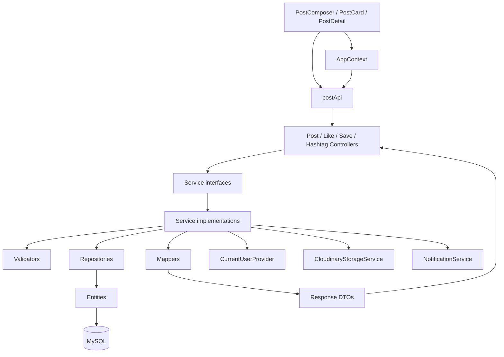

# Code walkthrough toàn bộ module Post

> Ngày rà soát: 2026-07-29
> Phạm vi chính: toàn bộ production code và test trong package Backend `post`, toàn bộ feature Frontend `post`, cùng các điểm tích hợp trực tiếp.  
> Mục tiêu: giúp người đọc mở code theo đúng thứ tự và hiểu trách nhiệm của từng file.

## 1. Cách đọc tài liệu

Tài liệu được tổ chức theo đường đi của request:

```text
Frontend UI
→ postApi
→ Controller
→ Service interface
→ Service implementation
→ Validation
→ Repository
→ Entity
→ MySQL/Cloudinary
→ Mapper
→ Response DTO
→ Frontend state/UI
```

Hai tài liệu có vai trò khác nhau:

- `POST-CURRENT-IMPLEMENTATION-ANALYSIS.md`: code hiện tại đã hoàn thành đến đâu.
- `POST-CODE-WALKTHROUGH.md`: từng file/class/function đang làm gì.

## 2. Cấu trúc module

### 2.1. Backend production

```text
post/
├── controller/   4 file
├── dto/
│   ├── request/  2 file
│   └── response/ 10 file
├── entity/       8 file
├── enums/        2 file
├── mapper/       2 file
├── repository/   7 file
├── service/
│   ├── interface 4 file
│   └── impl/     4 file
└── validation/   3 file
```

Tổng cộng: 47 file Java production trong package `post`.

### 2.2. Frontend feature

```text
features/post/
├── components/
│   ├── PostCard.jsx
│   ├── PostComposer.jsx
│   └── ReportPostFlow.jsx
└── pages/
    ├── PostDetailPage.jsx
    └── SavedPostsPage.jsx
```

Ngoài feature còn có:

- `src/api/postApi.js`.
- `src/api/apiEndpoints.js`.
- `src/contexts/AppContext.jsx`.

### 2.3. Test

Package test `post` hiện có 20 file, phủ Controller, Service, Repository, Entity mapping và Validation.

## 3. Bản đồ phụ thuộc



## 4. Controller layer

### 4.1. `PostController.java`

Base path: `/api/v1/posts`.

#### `createPost`

```java
POST /api/v1/posts
Content-Type: multipart/form-data
```

Nhận:

- `content`.
- `hashtag`.
- `mediaFiles`.

Controller gom ba nhóm dữ liệu thành `CreatePostRequest`, gọi `PostService.createPost` và trả `201 Created`.

Điểm quan trọng:

- Không nhận `authorId`.
- Không tự validation nghiệp vụ.
- Không upload media.
- Không mở transaction.

#### `getPostDetail`

```java
GET /api/v1/posts/{postId}
```

Chỉ truyền `postId` xuống Service và trả `PostDetailResponse`.

#### `updatePost`

```java
PUT /api/v1/posts/{postId}
Content-Type: multipart/form-data
```

Nhận:

- `content`.
- `hashtag`.
- `keepMediaIds`.
- `newMediaFiles`.

`keepMediaIds` quyết định media cũ nào được giữ. Controller chuyển request thành `UpdatePostRequest`.

#### `deletePost`

```java
DELETE /api/v1/posts/{postId}
```

Gọi xóa mềm và trả `DeletePostResponse`.

### 4.2. `PostLikeController.java`

Base path: `/api/v1/posts/{postId}/likes`.

- `likePost`: POST, gọi `PostLikeService.likePost`.
- `unlikePost`: DELETE, gọi `PostLikeService.unlikePost`.

Không có body và không nhận user ID.

### 4.3. `SavedPostController.java`

Base path: `/api/v1/posts/{postId}/saves`.

- `savePost`: POST.
- `unsavePost`: DELETE.

Controller này chỉ có mutation. Không có endpoint lấy danh sách Saved Posts.

### 4.4. `HashtagController.java`

Base path: `/api/v1/hashtags`.

`GET /suggestions?keyword=` gọi `HashtagService.getSuggestions`.

API không phân trang; giới hạn item do Service/Repository quyết định.

## 5. Request DTO

### 5.1. `CreatePostRequest.java`

Java record chứa:

- `String content`.
- `String hashtag`.
- `List<MultipartFile> mediaFiles`.

DTO không chứa Bean Validation annotations. Validation thực tế nằm trong `PostValidationSupport`, `PostImageFileValidator` và `HashtagNormalizer`.

### 5.2. `UpdatePostRequest.java`

Java record chứa:

- `String content`.
- `String hashtag`.
- `List<Long> keepMediaIds`.
- `List<MultipartFile> newMediaFiles`.

    Semantics:

    - `keepMediaIds == null`: giữ toàn bộ media cũ.
    - `keepMediaIds` rỗng: xóa toàn bộ media cũ.
    - `hashtag == null`: Service hiểu là field không được cung cấp và giữ hashtag cũ.
    - Hashtag normalize thành rỗng/null khi field được cung cấp: gỡ hashtag.

    Điểm cần chú ý: multipart parameter không thể hiện presence/null rõ như JSON patch, nên Client phải gửi request nhất quán.

## 6. Response DTO

### 6.1. `PostResponse.java`

Response sau khi tạo Post, gồm:

- ID.
- Content.
- Status.
- `isEdited`.
- Like/comment counters.
- Published/created/updated timestamps.
- Author.
- Media.
- Hashtag.

### 6.2. `PostDetailResponse.java`

Gần giống `PostResponse`, nhưng:

- Không trả public status.
- Có `PostViewerResponse`.

Hiện viewer response mới mô tả ownership, chưa chứa liked/saved.

### 6.3. `PostAuthorResponse.java`

Chỉ trả dữ liệu tác giả công khai:

- ID.
- Display name.
- Avatar URL.

Không có email hoặc auth data.

### 6.4. `PostMediaResponse.java`

Trả metadata hiển thị:

- ID.
- URL.
- Media type.
- MIME type.
- File size.
- Width/height.
- Duration.
- Thumbnail.
- Display order.

Không trả Cloudinary public ID.

### 6.5. `PostViewerResponse.java`

Hiện chứa `owner`.

Đây là DTO nhỏ nhưng quan trọng vì nó xác định action Edit/Delete ở Client.

### 6.6. `PostLikeResponse.java`

Chứa:

- Post ID.
- Trạng thái Like của viewer.
- Like count mới nhất.

### 6.7. `PostSaveResponse.java`

Chứa:

- Post ID.
- `saved`.

### 6.8. `DeletePostResponse.java`

Chứa:

- Post ID.
- Cờ xác nhận đã xóa mềm.

### 6.9. `HashtagSuggestionItemResponse.java`

Một item suggestion:

- Tên hashtag.
- Post count.

### 6.10. `HashtagSuggestionListResponse.java`

Bao danh sách suggestion và metadata keyword/response cần thiết của API.

## 7. Entity layer

### 7.1. `Post.java`

Entity trung tâm, ánh xạ bảng `posts`.

#### Field chính

| Field Java | Cột | Vai trò |
|---|---|---|
| `id` | `id` | Primary key |
| `author` | `author_id` | Tác giả |
| `authorProfile` | join read-only theo `author_id` | Đọc public profile không cần query thủ công |
| `content` | `content` | Nội dung tối đa 500 |
| `status` | `status` | PUBLISHED/HIDDEN/DELETED |
| `edited` | `is_edited` | Đã chỉnh sửa |
| `likeCount` | `like_count` | Counter do trigger |
| `commentCount` | `comment_count` | Counter do trigger |
| `publishedAt` | `published_at` | Mốc đăng |
| `hiddenBy` | `hidden_by` | Admin ẩn |
| `hiddenAt` | `hidden_at` | Thời điểm ẩn |
| `hiddenReason` | `hidden_reason` | Lý do |
| `deletedAt` | `deleted_at` | Mốc xóa mềm |
| `media` | quan hệ | Danh sách media |
| `postHashtags` | quan hệ | Quan hệ hashtag |

`Post` kế thừa `BaseAuditEntity`, nên nhận `createdAt` và `updatedAt`.

#### Mapping đáng chú ý

- `author` dùng LAZY.
- `authorProfile` là join read-only, dùng cùng `author_id`.
- Collection không EAGER.
- Cascade chỉ PERSIST/MERGE cho media và hashtag relation; xóa nghiệp vụ được Service kiểm soát.

### 7.2. `PostMedia.java`

Ánh xạ `post_media`.

Chứa toàn bộ metadata storage:

- `mediaUrl`.
- `storagePublicId`.
- `mediaType`.
- `mimeType`.
- `fileSizeBytes`.
- `widthPx`.
- `heightPx`.
- `durationSeconds`.
- `thumbnailUrl`.
- `displayOrder`.
- `createdAt`.

Entity không tự upload/xóa file; nhiệm vụ đó thuộc `CloudinaryStorageService`.

### 7.3. `Hashtag.java`

Ánh xạ `hashtags`.

- `normalizedName`: khóa nghiệp vụ unique.
- `displayName`: tên hiển thị.
- `postCount`: counter.
- `postHashtags`: quan hệ ngược.

Kế thừa audit timestamps.

### 7.4. `PostHashtag.java`

Entity bảng nối `post_hashtags`.

- Dùng `@EmbeddedId`.
- `@MapsId("postId")`.
- `@MapsId("hashtagId")`.
- Có `createdAt` do DB sinh.

### 7.5. `PostHashtagId.java`

Composite key:

- `postId`.
- `hashtagId`.

Có `equals/hashCode` để JPA quản lý identity đúng.

### 7.6. `PostLike.java`

Entity bảng nối `post_likes`.

- Embedded ID.
- Quan hệ Post.
- Quan hệ User.
- `createdAt`.

Insert/delete entity này kích hoạt trigger cập nhật `posts.like_count`.

### 7.7. `PostLikeId.java`

Composite key:

- `userId`.
- `postId`.

Đồng thời là constraint chống Like trùng.

### 7.8. `SavedPost.java`

Entity bảng `saved_posts`.

- Embedded ID.
- Quan hệ User.
- Quan hệ Post.
- `createdAt`.

### 7.9. `SavedPostId.java`

Composite key:

- `userId`.
- `postId`.

Là constraint chống Save trùng.

## 8. Enum

### 8.1. `PostStatus.java`

Giá trị:

- `PUBLISHED`.
- `HIDDEN`.
- `DELETED`.

Được dùng bởi Post Entity, query public, xóa mềm và Admin moderation.

### 8.2. `PostMediaType.java`

Giá trị:

- `IMAGE`.
- `VIDEO`.

Code và README hiện cùng hỗ trợ ảnh/video trong tổng giới hạn media của Post.

## 9. Repository layer

### 9.1. `PostRepository.java`

Repository quan trọng nhất.

#### `searchPublishedPostsByContent`

Native MySQL FULLTEXT:

- Join user/profile.
- Chỉ Post `PUBLISHED`.
- Chỉ tác giả ACTIVE và profile completed.
- Dùng natural-language relevance.
- Có count query riêng cho pagination.

#### `searchPublishedPostsByHashtag`

Native query:

- Join `post_hashtags` và `hashtags`.
- Match exact normalized name.
- Lọc Post/tác giả hợp lệ.
- Có pagination.

#### `findByIdAndStatus`

Lookup đơn giản theo ID/status.

#### `findStatusById`

Chỉ lấy status, tránh fetch cả Entity khi Like/Save cần phân biệt trạng thái.

#### `findInteractionTargetById`

Projection gồm:

- Post ID.
- Author ID.
- Status.

Dùng cho Like/Save/Notification mà không load graph lớn.

#### `findReportSnapshotById`

EntityGraph tải:

- Post.
- Author.
- Media.

Dùng khi Report tạo snapshot nhất quán.

#### `findLikeCountById`

Native query đọc counter mới nhất sau trigger.

#### `existsByIdAndAuthor_Id`

Kiểm tra ownership nhanh.

#### `findDetailHeaderByIdAndStatus`

EntityGraph tải:

- Author.
- Author profile.

Media và hashtag được đọc riêng để tránh fetch nhiều collection cùng lúc.

#### `markEdited`

Native update đặt:

- `is_edited = true`.
- `updated_at = CURRENT_TIMESTAMP(6)`.

Cần thiết khi chỉ sửa bảng con media/hashtag.

#### `softDeletePublishedPost`

Conditional update:

- Chỉ `PUBLISHED`.
- Đổi `DELETED`.
- Đặt `deleted_at`, `updated_at`.

Return số row giúp phát hiện race.

### 9.2. `PostMediaRepository.java`

Cung cấp:

- Lấy media theo Post, sort display order.
- Lấy subset media theo Post và ID.

Dùng cho Detail và Update.

### 9.3. `HashtagRepository.java`

#### Suggestion query

Tìm hashtag theo keyword và ưu tiên theo `post_count`.

#### `insertIfAbsent`

Native insert/upsert để hai request đồng thời không tạo hai hashtag cùng normalized name.

#### `findByNormalizedName`

Đọc lại Entity sau upsert.

### 9.4. `PostHashtagRepository.java`

Cung cấp:

- Xóa relation theo Post ID.
- Đọc relation và fetch Hashtag.
- Batch-read hashtag cho nhiều Post ID.

Batch method có thể phục vụ Search/list response mà không N+1.

### 9.5. `PostLikeRepository.java`

Cung cấp:

- CRUD qua composite ID.
- Batch lấy tập Post ID đã Like của một viewer.
- Conditional delete relation Like.

Batch query là nền cho viewer state ở danh sách.

### 9.6. `SavedPostRepository.java`

Cung cấp:

- CRUD Save relation.
- Batch lấy tập Post ID đã Save.
- Conditional delete.

Chưa có query trả page Saved Posts.

### 9.7. `PostInteractionTargetProjection.java`

Interface projection tối giản:

- `getPostId`.
- `getAuthorId`.
- `getStatus`.

Giảm dữ liệu đọc cho interaction service.

## 10. Mapper layer

### 10.1. `PostMapper.java`

#### `toResponse`

Map Post vừa tạo thành `PostResponse`.

#### `toDetailResponse`

Map Detail và thêm viewer ownership.

#### `toAuthorResponse`

Map `UserProfile` sang author public DTO.

#### `toMediaResponse`

Map media nhưng loại bỏ `storagePublicId`.

Mapper không truy cập Repository, nên không gây query ẩn nếu Service đã tải đủ dữ liệu.

### 10.2. `HashtagMapper.java`

Map `Hashtag` thành suggestion item, chủ yếu lấy normalized/display name và post count.

## 11. Service interface

### 11.1. `PostService.java`

Contract:

- `createPost`.
- `getPostDetail`.
- `updatePost`.
- `deletePost`.

### 11.2. `PostLikeService.java`

Contract:

- `likePost`.
- `unlikePost`.

### 11.3. `SavedPostService.java`

Contract:

- `savePost`.
- `unsavePost`.

### 11.4. `HashtagService.java`

Contract:

- `getSuggestions`.

Interface giúp Controller không phụ thuộc implementation.

## 12. `PostServiceImpl.java`

Đây là file lớn nhất và là trung tâm nghiệp vụ Post.

### 12.1. Dependency

| Dependency | Mục đích |
|---|---|
| `CurrentUserProvider` | Lấy user từ JWT |
| `UserRepository` | Kiểm tra user/status |
| `UserProfileRepository` | Kiểm tra profile completion |
| `PostRepository` | CRUD Post |
| `PostMediaRepository` | CRUD media metadata |
| `HashtagRepository` | Upsert/read hashtag |
| `PostHashtagRepository` | Quản lý relation |
| `PostValidationSupport` | Validate content |
| `PostImageFileValidator` | Validate media |
| `HashtagNormalizer` | Normalize hashtag |
| `CloudinaryStorageService` | Upload/delete file |
| `PostMapper` | Tạo response |
| `TransactionTemplate` | Transaction create sau upload |
| `EntityManager` | Flush/refresh |
| `Clock` | Deadline và timestamp testable |

### 12.2. `createPost`

Thứ tự:

1. Lấy author ID.
2. `ensureAuthorCanCreatePost`.
3. `validateRequest`.
4. `uploadMedia`.
5. Dùng `TransactionTemplate` gọi `createPostInDatabase`.
6. Nếu DB lỗi, `cleanupUploadedMedia`.

Điểm thiết kế: upload ngoài transaction, ghi DB trong transaction ngắn.

### 12.3. `getPostDetail`

1. Kiểm tra viewer.
2. Query `PUBLISHED`.
3. Kiểm tra author ACTIVE/profile tồn tại.
4. Query media.
5. Query một hashtag.
6. Tính owner.
7. Map response.

### 12.4. `updatePost`

1. Kiểm tra viewer.
2. Query Post `PUBLISHED`.
3. Kiểm tra owner/deadline.
4. Validate request và resolve media giữ/xóa.
5. Upload media mới.
6. Đăng ký transaction synchronization để cleanup đúng thời điểm.
7. Update DB.
8. Map Detail.

Method có `@Transactional`.

### 12.5. `deletePost`

1. Kiểm tra viewer.
2. Query Post `PUBLISHED`.
3. Kiểm tra owner.
4. Tạo `deletedAt` bằng Clock.
5. Conditional soft delete.
6. Nếu không update row, trả `POST_NOT_FOUND`.

### 12.6. `validateRequest`

- Validate media.
- Đếm slot media.
- Normalize/validate content.
- Normalize hashtag.
- Đổi null list thành list rỗng.

### 12.7. `ensureAuthorCanCreatePost`

Kiểm tra:

- User tồn tại.
- ACTIVE.
- Profile tồn tại.
- Profile completed.

Trả `AuthorContext` để không query lại trong create transaction.

### 12.8. `ensureViewerCanUsePostApi`

Áp dụng cùng guard ACTIVE/profile-completed cho read/update/delete.

### 12.9. `ensureCanEditPost`

Kiểm tra:

- Owner.
- Author ACTIVE/profile hợp lệ.
- Deadline `publishedAt + 15 phút`.

Clock được inject giúp test biên thời gian ổn định.

### 12.10. `ensureCanDeletePost`

Kiểm tra owner và author hợp lệ.

### 12.11. `validateUpdateRequest`

Xử lý phần phức tạp nhất:

- Validate new media.
- Normalize content.
- Phân biệt hashtag absent với remove/change.
- Đọc media hiện có.
- Resolve `keepMediaIds`.
- Tính media bị xóa.
- Đếm ảnh/video cuối cùng.
- Validate composition.
- Bảo đảm content hoặc media vẫn tồn tại.

### 12.12. `resolveKeptMedia`

- Null → giữ tất cả.
- Empty → giữ không media nào.
- Có ID → query đúng Post và sort.
- Nếu thiếu ID → `POST_MEDIA_NOT_FOUND`.

Ngăn Client giữ media thuộc Post khác.

### 12.13. `updatePostInDatabase`

1. Set content và edited.
2. Delete media bị bỏ.
3. Flush để tránh conflict unique display order.
4. Reorder media giữ lại.
5. Insert media mới.
6. Update hashtag.
7. `markEdited`.
8. Flush/refresh.
9. Đọc lại media và hashtag.

### 12.14. `reorderKeptMedia`

Đánh lại thứ tự liên tục từ 0. Media cũ đứng trước media mới.

### 12.15. `registerStorageCleanup`

Đăng ký callback transaction:

- `afterCommit`: xóa file media cũ.
- `afterCompletion` rollback: xóa file mới.

Đây là cầu nối giữa tính nhất quán DB và external storage.

### 12.16. `uploadMedia`

Với từng file:

1. Detect image/video.
2. Gọi upload phù hợp.
3. Với video, kiểm tra duration từ kết quả Cloudinary.
4. Nếu duration lỗi, xóa ngay file vừa upload.
5. Tạo `UploadedPostMedia`.

Nếu bất kỳ file nào lỗi, cleanup các file đã upload trước đó.

### 12.17. `createPostInDatabase`

1. Insert Post.
2. Insert media.
3. Insert hashtag relation.
4. Refresh Post để lấy DB-generated timestamps.
5. Map response.

### 12.18. `toPostMedia`

Chuyển `CloudinaryUploadResult` thành Entity `PostMedia`.

### 12.19. `savePostHashtag`

Không làm gì nếu hashtag null; ngược lại resolve hashtag và insert relation.

### 12.20. `updatePostHashtag`

Trường hợp:

- Field absent → giữ nguyên.
- Normalized value giống cũ → giữ nguyên.
- Gỡ → xóa relation cũ.
- Đổi → xóa cũ, resolve mới, insert mới.

### 12.21. `resolveHashtag`

- Insert-if-absent.
- Read by normalized name.
- Nếu không đọc được sau insert → internal error.

### 12.22. `requireSingleRelation`

Service-level invariant:

- 0 relation → null.
- 1 relation → hợp lệ.
- Trên 1 → internal error.

Điều này phát hiện dữ liệu DB vi phạm “một hashtag”.

### 12.23. Cleanup helpers

- `cleanupUploadedMedia`: xóa media mới khi luồng thất bại.
- `cleanupRemovedMediaFiles`: xóa media cũ sau commit.
- Cleanup exception chỉ log warning để không che lỗi gốc.

### 12.24. Internal records

- `CreatePostCommand`: request đã validate.
- `UpdatePostCommand`: trạng thái update đã resolve.
- `UpdatedPostData`: dữ liệu đọc lại sau update.
- `AuthorContext`: User + Profile.
- `UploadedPostMedia`: upload result + type + order.

Các record giúp phân biệt raw request với validated command.

## 13. `PostLikeServiceImpl.java`

### 13.1. `likePost`

1. Lấy current user.
2. Kiểm tra user ACTIVE/profile completed.
3. Đọc interaction target.
4. Chỉ chấp nhận `PUBLISHED`.
5. Kiểm tra relation đã tồn tại.
6. Insert `PostLike`.
7. Flush để trigger chạy.
8. Đọc counter mới.
9. Tạo notification.
10. Trả response.

Unique key tại DB là lớp bảo vệ cuối cho concurrent Like.

### 13.2. `unlikePost`

1. Guard user/Post.
2. Conditional delete.
3. Flush để trigger chạy.
4. Đọc counter.
5. Trả `liked = false`.

### 13.3. Helper

- `ensureCurrentUserCanInteract`: guard user/profile.
- `findPublishedInteractionTarget`: query projection và check status.
- `getLatestLikeCount`: đọc counter sau trigger.

## 14. `SavedPostServiceImpl.java`

### 14.1. `savePost`

1. Lấy current user.
2. Guard ACTIVE/profile completed.
3. Kiểm tra Post `PUBLISHED`.
4. Nếu đã Save, trả trạng thái đã Save hoặc xử lý idempotent theo implementation.
5. Insert `SavedPost`.
6. Chống race bằng composite PK/transaction.

### 14.2. `unsavePost`

- Guard tương tự.
- Conditional delete relation.
- Trả `saved = false`, kể cả relation đã không còn.

### 14.3. Helper

- `ensureCurrentUserCanSave`.
- `ensurePostIsPublished`.

`TransactionTemplate` riêng hỗ trợ xử lý duplicate/race trong Save.

## 15. `HashtagServiceImpl.java`

### 15.1. Guard

Suggestion vẫn là social API:

- Cần current user.
- User ACTIVE.
- Profile completed.

### 15.2. Keyword rules

- Keyword null/rỗng có response rỗng.
- Có minimum length.
- Có maximum length 100.
- Normalize bằng cùng `HashtagNormalizer`.

### 15.3. Query và mapping

- Repository lấy danh sách giới hạn.
- Mapper đổi sang item response.
- Service bao danh sách trong `HashtagSuggestionListResponse`.

## 16. Validation

### 16.1. `PostValidationSupport.java`

#### `normalizeContent`

- Trim content.
- Empty thành null.
- Kiểm tra tối đa 500.

#### `validateForCreate`

Normalize content rồi kiểm tra content/media.

#### `validateContentOrImagePresent`

Nếu content null/rỗng và media count 0 → lỗi.

Tên method còn dùng từ “Image” dù implementation đã hỗ trợ video/media.

### 16.2. `HashtagNormalizer.java`

Pipeline:

1. Xử lý null.
2. Trim Unicode whitespace.
3. Bỏ các dấu `#` đầu.
4. Trim lần nữa.
5. Gộp whitespace liên tiếp.
6. Unicode NFC.
7. Lowercase theo locale ổn định.
8. Đếm code point.
9. Empty thành null hoặc validation error tùy trạng thái.

Normalizer được tái sử dụng khi create/update/suggestion/search hashtag.

### 16.3. `PostImageFileValidator.java`

Mặc dù tên class là Image, code xử lý cả video.

Trách nhiệm:

- Loại file rỗng.
- Giới hạn tổng 4 media.
- Detect media type.
- Whitelist MIME.
- Kiểm tra extension.
- Kiểm tra file signature/magic bytes.
- Giới hạn size khác nhau cho image/video.
- Tối đa một video.
- Validate composition sau update.
- Đếm media slots.

Duration video được kiểm tra sau upload vì metadata đáng tin cậy lấy từ Cloudinary.

## 17. Frontend API

### 17.1. `src/api/apiEndpoints.js`

Nhóm `POST_ENDPOINTS` khai báo:

- Root/detail.
- Likes.
- Saves.
- Reports.
- Comments/replies.
- Hashtag suggestions.

Tất cả dynamic ID đều `encodeURIComponent`.

### 17.2. `src/api/postApi.js`

#### `appendValue`

Chỉ append giá trị không null/undefined/rỗng vào FormData.

#### `createPostForm`

Map payload UI thành:

- content.
- hashtag.
- nhiều mediaFiles.

#### `updatePostForm`

Map:

- content.
- hashtag.
- nhiều keepMediaIds.
- nhiều newMediaFiles.

#### API methods

- `create`.
- `getDetail`.
- `update`.
- `remove`.
- `like`.
- `unlike`.
- `save`.
- `unsave`.
- `report`.
- `getComments`.
- `createComment`.
- `getReplies`.
- `createReply`.
- `deleteComment`.
- `suggestHashtags`.

Mọi response đi qua `requestData` để lấy payload chuẩn từ `ApiResponse`.

## 18. Frontend state integration

### 18.1. `AppContext.jsx`

Đây không nằm trong folder Post nhưng là điểm tích hợp quan trọng nhất.

#### `toPostView`

Chuyển Backend response sang shape UI:

- `author.id → authorId`.
- `media[].url → imageUrls`.
- Một `hashtag → hashtags[]`.
- `isEdited → edited`.
- Chuẩn hóa liked/saved state.

Tên `imageUrls` không còn chính xác khi media có video.

#### `createPost`

- Gọi API thật.
- Thêm response vào đầu `data.posts`.

#### `updatePost`

- Ưu tiên `keepMediaIds` do form sửa tạo từ Post Detail; chỉ fallback local state cho caller cũ.
- Truyền `newMediaFiles` để cho phép thêm ảnh/video mới.
- Gọi API.
- Thay item trong local state.
- Deadline sửa Post được tính bằng `Clock` UTC để khớp timestamp UTC do MySQL/API trả về.
- `PostCard` hiển thị countdown 15 phút cạnh hành động sửa và tự ẩn hành động ở `00:00`.

#### `deletePost`

- Gọi API.
- Đổi local Post thành `DELETED`.

#### `toggleLike`

- Suy trạng thái từ Post hoặc mock `data.likes`.
- Gọi Like/Unlike.
- Update local count/state.

#### `toggleSave`

- Suy trạng thái từ Post hoặc mock `savedPosts`.
- Gọi Save/Unsave.
- Update local relation và Post state.

#### Comment/Report

- Create/delete comment gọi API thật.
- Report gọi API thật.

Giới hạn kiến trúc: state khởi tạo bằng mock data, trong khi mutation ghi database thật.

## 19. Frontend components

### 19.1. `PostComposer.jsx`

File chịu trách nhiệm UI tạo Post.

#### State

- Content.
- Hashtag.
- Suggestions.
- Media previews.
- Error.
- Option menu.

#### `readVideoDuration`

Dùng `<video>` browser đọc metadata cho UX validation trước upload.

#### Hashtag effect

- `PostHashtagPicker` dùng chung cho tạo/sửa Post.
- Debounce 250 ms, hủy request cũ và gọi suggestion API.
- Hiển thị hashtag có sẵn bên dưới ô nhập để người dùng chọn.

#### `handleMediaChange`

Kiểm tra:

- MIME được hỗ trợ.
- Tổng tối đa 4.
- Tối đa 1 video.
- Image 10 MB.
- Video 100 MB.
- Video tối đa 180 giây.

Tạo object URL để preview.

#### `handleRemoveMedia`

Revoke object URL và xóa preview.

#### `submit`

Gọi `AppContext.createPost` với raw File objects.

#### Phần chỉ là UI

Menu audience/reply/quote hiện chưa nối Backend.

### 19.2. `PostCard.jsx`

Component hiển thị và thao tác Post ở nhiều màn hình.

Trách nhiệm:

- Resolve tác giả từ AppContext.
- Hiển thị content/hashtag/media.
- Hiển thị Like/Comment counters.
- Like/Save qua AppContext.
- Điều hướng Detail/Profile.
- Owner menu: Edit/Delete.
- Non-owner menu: Report/Save.
- Copy link.
- Mở Report flow.
- Hiển thị modal Edit/Delete.

Điểm cần chú ý:

- Component đang chứa khá nhiều orchestration và modal state.
- Edit gọi Post Detail trước khi dựng form, dùng `PostHashtagPicker` chung và gửi `keepMediaIds`/`newMediaFiles` từ `EditPostMedia`.
- Phụ thuộc dữ liệu mock cho một số author/viewer relations.

### 19.3. `ReportPostFlow.jsx`

Flow nhiều bước:

1. Chọn reason.
2. Nhập description/xem detail.
3. Submit report.
4. Hiển thị success/error.

Gọi callback `submitReport` từ AppContext; reason phải khớp enum Backend.

### 19.4. `PostDetailPage.jsx`

Luồng:

1. Lấy `postId` từ route.
2. Gọi `postApi.getDetail`.
3. Map response sang PostCard shape.
4. Gọi `postApi.getComments`.
5. Hiển thị PostCard detail.
6. Cho tạo comment.
7. Hiển thị danh sách comment.

Điểm tích hợp:

- Đây là page Post chính dùng GET Backend thật.
- Error/loading có state riêng.
- Comment pagination hiện mới dùng trang đầu trong UI cơ bản.

### 19.5. `SavedPostsPage.jsx`

Hiện:

- Đọc `data.savedPosts`.
- Map relation sang `data.posts`.
- Lọc Post `PUBLISHED`.
- Render `PostCard`.

Không gọi Backend GET list. Vì vậy đây là UI mock/local-state chứ chưa phải Saved list end-to-end.

## 20. Code ngoài package Post nhưng phụ thuộc trực tiếp

### 20.1. Interaction/Comment

Các class:

- `CommentController`.
- `CommentService`.
- `CommentServiceImpl`.
- `CommentRepository`.
- `Comment` entity.
- Comment DTO/Mapper/Status.

Chúng ghi `comments` và gián tiếp cập nhật `posts.comment_count` qua trigger.

### 20.2. Search

- `SearchController`.
- `SearchServiceImpl`.
- `SearchPostMapper`.
- `SearchPostResponse`.

Search gọi query trong `PostRepository`, batch media/hashtag/liked/saved để tạo result Post.

### 20.3. Report

- `ReportController`.
- `ReportServiceImpl`.
- `ReportRepository`.
- `Report` entity.

Report dùng `PostRepository.findReportSnapshotById`.

### 20.4. Admin

- `AdminPostController/Service/Repository/Mapper`.
- `AdminReportController/Service/Repository/Mapper`.
- `AdminPostModerationHelper`.

Admin đọc và thay đổi `Post.status`, moderation fields, report và audit.

### 20.5. Storage

- `CloudinaryStorageService`.
- `CloudinaryStorageServiceImpl`.
- `CloudinaryUploadResult`.

PostService chỉ phụ thuộc abstraction, nên unit test mock storage dễ dàng.

### 20.6. Notification

Like, Comment, Hide/Restore và xử lý Report có thể tạo notification liên quan Post.

### 20.7. Security

- `CurrentUserProvider`.
- `CustomUserPrincipal`.
- JWT filter.
- Profile-completion filter.

Service vẫn tự kiểm tra ACTIVE/profile completed, tạo defense-in-depth.

## 21. Database code liên quan

### 21.1. `posts`

Lưu core state, counters và moderation metadata.

### 21.2. `post_media`

Lưu Cloudinary metadata; có unique public ID và display order.

### 21.3. `hashtags` và `post_hashtags`

Lưu dictionary hashtag và relation.

### 21.4. `post_likes`

Composite PK chống trùng.

### 21.5. `saved_posts`

Composite PK chống trùng.

### 21.6. Trigger

- `trg_post_likes_after_insert`.
- `trg_post_likes_after_delete`.
- `trg_comments_after_insert`.
- `trg_comments_after_update`.
- `trg_post_hashtags_after_insert`.
- `trg_post_hashtags_after_delete`.

Service code dựa trực tiếp vào các trigger này. Nếu môi trường database thiếu trigger, counters sẽ sai.

## 22. Toàn bộ test trong package Post

### 22.1. Controller tests

#### `PostControllerTest.java`

Kiểm tra mapping create/detail/update/delete, response status/body và Service delegation.

#### `PostLikeControllerTest.java`

Kiểm tra Like/Unlike endpoint.

#### `SavedPostControllerTest.java`

Kiểm tra Save/Unsave endpoint.

#### `HashtagControllerTest.java`

Kiểm tra suggestion endpoint.

#### `HashtagSecurityTest.java`

Kiểm tra authentication/profile security cho hashtag API.

### 22.2. Service tests

#### `PostServiceImplTest.java`

File test lớn nhất, phủ:

- Create success/error.
- User/profile guard.
- Validation.
- Upload/cleanup.
- Detail filtering.
- Owner/deadline.
- Update content/hashtag/media.
- Rollback cleanup.
- Soft delete.
- Race/error paths.

#### `PostLikeServiceImplTest.java`

Phủ Like/Unlike, duplicate, Post status, user guard, counter và notification.

#### `SavedPostServiceImplTest.java`

Phủ Save/Unsave, idempotency, duplicate/race và guard.

#### `HashtagServiceImplTest.java`

Phủ keyword, normalization, guard, giới hạn và mapping.

### 22.3. Repository contract/integration

#### `PostRepositoryContractTest.java`

Kiểm tra các method/query quan trọng tồn tại đúng contract.

#### `SearchPostRepositoryContractTest.java`

Kiểm tra FULLTEXT/hashtag query contract.

#### `PostInteractionTargetRepositoryContractTest.java`

Kiểm tra projection query cho interaction.

#### `SavedPostRepositoryContractTest.java`

Kiểm tra batch/conditional query Save.

#### `HashtagSuggestionRepositoryContractTest.java`

Kiểm tra query suggestion.

#### `HashtagSuggestionRepositoryIntegrationTest.java`

Chạy integration cho ordering/filter của suggestion.

### 22.4. Entity mapping

#### `PostEntityMappingTest.java`

Kiểm tra annotation/mapping của Post và relation quan trọng.

#### `SavedPostEntityMappingTest.java`

Kiểm tra embedded ID và relation Save.

### 22.5. Validation tests

#### `PostValidationSupportTest.java`

Phủ normalize content, max length và content/media invariant.

#### `HashtagNormalizerTest.java`

Phủ dấu `#`, whitespace, Unicode NFC, lowercase và code-point limit.

#### `PostImageFileValidatorTest.java`

Phủ MIME, signature, extension, size, media count và composition.

## 23. File-by-file coverage checklist

### Controller

- [x] `HashtagController.java`
- [x] `PostController.java`
- [x] `PostLikeController.java`
- [x] `SavedPostController.java`

### Request DTO

- [x] `CreatePostRequest.java`
- [x] `UpdatePostRequest.java`

### Response DTO

- [x] `DeletePostResponse.java`
- [x] `HashtagSuggestionItemResponse.java`
- [x] `HashtagSuggestionListResponse.java`
- [x] `PostAuthorResponse.java`
- [x] `PostDetailResponse.java`
- [x] `PostLikeResponse.java`
- [x] `PostMediaResponse.java`
- [x] `PostResponse.java`
- [x] `PostSaveResponse.java`
- [x] `PostViewerResponse.java`

### Entity/ID

- [x] `Hashtag.java`
- [x] `Post.java`
- [x] `PostHashtag.java`
- [x] `PostHashtagId.java`
- [x] `PostLike.java`
- [x] `PostLikeId.java`
- [x] `PostMedia.java`
- [x] `SavedPost.java`
- [x] `SavedPostId.java`

### Enum

- [x] `PostMediaType.java`
- [x] `PostStatus.java`

### Mapper

- [x] `HashtagMapper.java`
- [x] `PostMapper.java`

### Repository/projection

- [x] `HashtagRepository.java`
- [x] `PostHashtagRepository.java`
- [x] `PostLikeRepository.java`
- [x] `PostMediaRepository.java`
- [x] `PostRepository.java`
- [x] `PostInteractionTargetProjection.java`
- [x] `SavedPostRepository.java`

### Service

- [x] `HashtagService.java`
- [x] `PostLikeService.java`
- [x] `PostService.java`
- [x] `SavedPostService.java`
- [x] `HashtagServiceImpl.java`
- [x] `PostLikeServiceImpl.java`
- [x] `PostServiceImpl.java`
- [x] `SavedPostServiceImpl.java`

### Validation

- [x] `HashtagNormalizer.java`
- [x] `PostImageFileValidator.java`
- [x] `PostValidationSupport.java`

### Frontend feature

- [x] `PostCard.jsx`
- [x] `PostComposer.jsx`
- [x] `ReportPostFlow.jsx`
- [x] `PostDetailPage.jsx`
- [x] `SavedPostsPage.jsx`

### Frontend integration

- [x] `postApi.js`
- [x] `apiEndpoints.js`
- [x] `AppContext.jsx`

### Test

- [x] `HashtagControllerTest.java`
- [x] `HashtagSecurityTest.java`
- [x] `PostControllerTest.java`
- [x] `PostLikeControllerTest.java`
- [x] `SavedPostControllerTest.java`
- [x] `PostEntityMappingTest.java`
- [x] `SavedPostEntityMappingTest.java`
- [x] `HashtagSuggestionRepositoryContractTest.java`
- [x] `HashtagSuggestionRepositoryIntegrationTest.java`
- [x] `PostInteractionTargetRepositoryContractTest.java`
- [x] `PostRepositoryContractTest.java`
- [x] `SavedPostRepositoryContractTest.java`
- [x] `SearchPostRepositoryContractTest.java`
- [x] `HashtagServiceImplTest.java`
- [x] `PostLikeServiceImplTest.java`
- [x] `PostServiceImplTest.java`
- [x] `SavedPostServiceImplTest.java`
- [x] `HashtagNormalizerTest.java`
- [x] `PostImageFileValidatorTest.java`
- [x] `PostValidationSupportTest.java`

## 24. Các điểm thiết kế đáng chú ý trong code

### Điểm tốt

- Upload ngoài DB transaction.
- Cleanup theo success/rollback.
- Current user lấy từ JWT.
- Controller mỏng.
- Entity không trả trực tiếp.
- Query Detail tránh fetch nhiều collection.
- Composite PK chống Like/Save trùng.
- Conditional soft delete.
- Pessimistic lock ở Admin.
- Clock injectable.
- Normalizer tái sử dụng.
- Batch repository đã chuẩn bị cho list/viewer state.

### Technical debt

- `PostServiceImpl` 569 dòng, đang gánh create, detail, update, delete, media lifecycle và hashtag.
- `PostImageFileValidator` và một số biến `imageCount/imageUrls` không còn đúng tên khi đã hỗ trợ video.
- Frontend `PostCard` và `PostComposer` đều hơn 340 dòng.
- AppContext trộn mock state và API mutation thật.
- Viewer response chưa đủ liked/saved.
- Location P1 đã có SQL/DBML/migration, Entity/Repository, resolver, validation, create/update API, batch enrichment response và Frontend Google Places picker.
- Hashtag “một Post một hashtag” mới enforce ở Service, chưa enforce tuyệt đối ở DB.
- External cleanup thất bại chưa có retry/outbox/job.

## 25. Thứ tự đọc code đề xuất

Để một developer mới hiểu module nhanh nhất:

1. `PostController.java`.
2. `CreatePostRequest.java`, `UpdatePostRequest.java`.
3. `PostService.java`.
4. `PostServiceImpl.java`.
5. Ba validation class.
6. `PostRepository.java`.
7. `Post.java`, `PostMedia.java`, `Hashtag.java`, `PostHashtag.java`.
8. `PostMapper.java` và response DTO.
9. Like Service/Repository/Entity.
10. Save Service/Repository/Entity.
11. Hashtag Service/Repository/Mapper.
12. `postApi.js`.
13. `AppContext.jsx`.
14. `PostComposer.jsx`.
15. `PostCard.jsx`.
16. `PostDetailPage.jsx`.
17. Test tương ứng với phần vừa đọc.

## 26. Kết luận

Module Post hiện có một write-side Backend khá trưởng thành, với validation, transaction, Cloudinary lifecycle, interaction và moderation. Code phức tạp nhất tập trung ở `PostServiceImpl`, `PostCard`, `PostComposer` và lớp tích hợp `AppContext`.

Các read-side Feed, Profile, Saved, Liked và Search batch-load Location cùng dữ liệu PostCard, không đổi cursor pagination. Location P1 đã tích hợp quan hệ `Location 1 — N Post`, unique `google_place_id`, khóa ngoại nullable `ON DELETE SET NULL`, resolver upsert an toàn cạnh tranh và không cascade remove. Khi refactor, nên bảo toàn upload ngoài transaction, cleanup theo transaction outcome, conditional update và database uniqueness.
